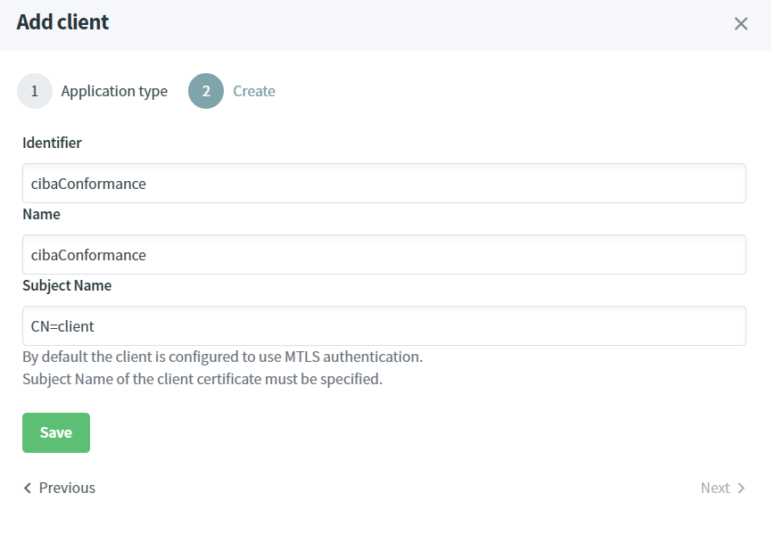
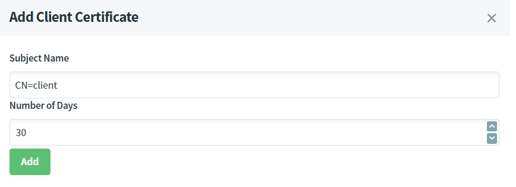
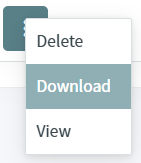

# Confidential Client uses CIBA

> [!WARNING]
> Before you start, Make sure you have an [up and running IdentityServer and IdentityServer website](/documentation/gettingstarted/index.html).

According to the [specification](https://openid.net/specs/openid-client-initiated-backchannel-authentication-core-1_0.html), Public Client cannot use Client-Initiated Backchannel Authentication(CIBA).
Only Confidential Client can use it, For example a Console Application, Website or a REST.API.

In this tutorial, we are going to explain how to create a Console Application. It will initiate a CIBA Authentication Request and will get an Access Token by polling the `Token` endpoint.

The client will have the following configuration :

| Configuration                            | Value           |
| ---------------------------------------- | --------------- |
| Client Authentication Method             | tls_client_auth |

## Source Code

The source code of this project can be found [here](https://github.com/simpleidserver/SimpleIdServer/tree/master/samples/DeviceUseCIBA).

## Add a client

The first step consists to configure the OPENID client

* Open the IdentityServer website [http://localhost:5002](http://localhost:5002).
* In the Clients screen, click on `Add client` button.
* Select `Device` and click on next.


* Fill-in the form like this and click on the `Save` button to confirm the creation.



* Navigate to the `Certificate Authorities`, click on the `Certificate Authority` that you are interested to create `Client Certificate`. The Certificate Authority MUST be trusted by your machine, don't forget to import it into the appropriate store.


* Click on `Client Certificates` tab and click on the `Add Certificate Client` button.
* Fill-in the form like this and click on `Add` button.



* Click on the Settings button next to the Client Certificate and click on `Download`. The certificate will be used later inside the Console Application.



## Create a console application

The last step consists to create and configure a Console Application project.

* Open a command prompt, run the following commands to create the directory structure for the solution.

```
mkdir DeviceUseCIBA
cd DeviceUseCIBA
mkdir src
dotnet new sln -n DeviceUseCIBA
```

* Create a console application named `ConsoleApp` and install the `IdentityModel` Nuget Package

```
cd src
dotnet new console -n ConsoleApp
cd ConsoleApp
dotnet add package IdentityModel
```

* Add the `ConsoleApp` project into your Visual Studio solution.

```
cd ..
dotnet sln add ./src/ConsoleApp/ConsoleApp.csproj
```

* Edit the `Program.cs` file and copy the following code. 

```
using IdentityModel.Client;
using System.Security.Authentication;
using System.Security.Cryptography.X509Certificates;

var certificate = new X509Certificate2(Path.Combine(Directory.GetCurrentDirectory(), "CN=client.pfx"));
var req = new BackchannelAuthenticationRequest()
{
    Address = "https://localhost:5001/master/mtls/bc-authorize",
    ClientId = "cibaConformance",
    Scope = "openid profile",
    LoginHint = "user",
    BindingMessage = "Message",
    RequestedExpiry = 200
};
var handler = new HttpClientHandler();
handler.ServerCertificateCustomValidationCallback = (message, cert, chain, errors) => { return true; };
handler.CheckCertificateRevocationList = false;
handler.ClientCertificateOptions = ClientCertificateOption.Manual;
handler.SslProtocols = SslProtocols.Tls12;
handler.ClientCertificates.Add(certificate);
var client = new HttpClient(handler);
var response = await client.RequestBackchannelAuthenticationAsync(req);

bool cont = true;
while(cont)
{
    var tokenResponse = await client.RequestBackchannelAuthenticationTokenAsync(new BackchannelAuthenticationTokenRequest
    {
        Address = "https://localhost:5001/master/mtls/token",
        ClientId = "cibaConformance",
        AuthenticationRequestId = response.AuthenticationRequestId
    });
    if(tokenResponse.IsError)
        Console.WriteLine(tokenResponse.Error);
    else
    {
        Console.WriteLine(tokenResponse.AccessToken);
        cont = false;
    }
}
```

* Replace the `CN=client.pfx` certificate by the one you have downloaded.

When you run the application, a green message will be displayed in the Identity Server instance. 
Copy the URL in the browser and authenticate with the credentials login : `user`, password: `password`.


When the consent is granted then the access token will be displayed by the console application.