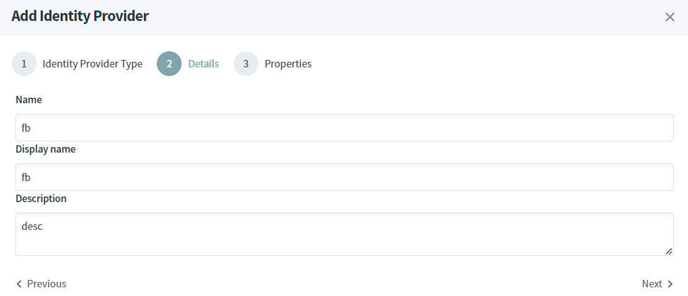
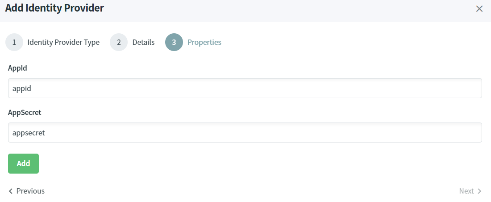

# Add Identity Providers

> [!WARNING]
> If you want to support more External Identity Providers, please create a ticket in Github, otherwise you can wait for the technical documentation.
> It will explain how to create a lite option, implement the interface IDynamicAuthenticationOptions<TOptions>.

In the Administration UI, you can add external Identity Providers.

To add an external Identity Provider :

* Open the IdentityServer website [http://localhost:5002](http://localhost:5002).
* In the Identity Providers screen, click on `Add Identity Provider` button.
* Select the type of Identity Provider for example facebook and click on Next.

* Fill-in the form, the Display Name is used by the Identity provider to display the list of external authentication methods.

* Fill-in the form. For more information about the properties, refer to the official documentation from [Microsoft](https://learn.microsoft.com/en-us/aspnet/core/security/authentication/social/?view=aspnetcore-7.0&tabs=visual-studio)

Once the External Identity Provider is added, it will be displayed in the authentication screen.

