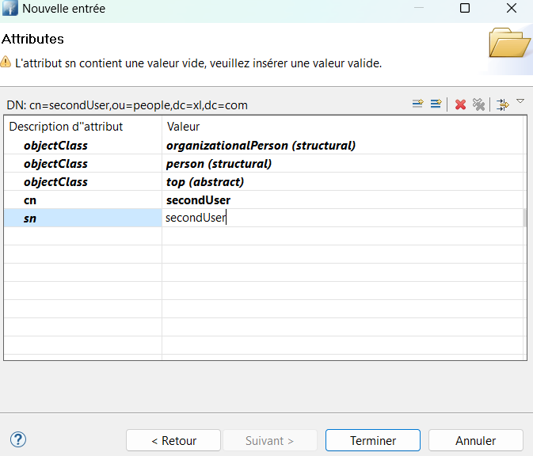

# LDAP

Users stored in the LDAP repository can be imported into the Identity Server.

In this tutorial, we will explain how to import users from [OPENLDAP](https://www.openldap.org/) to the Identity Server.

## Install OPENLDAP

Before proceeding further, please ensure that Docker is installed on your machine.

Open a command prompt and launch an OPENLDAP instance by executing the following command line:

```
docker run -p 389:389 -p 636:636 --name ldap-service -h ldap-service -e LDAP_ORGANISATION="XL" -e LDAP_DOMAIN="xl.com" -e LDAP_ADMIN_PASSWORD="password" -d osixia/openldap:latest
```

This command exposes LDAP over port 389 and LDAPS over port 636.

## Create some users

Download and install [Apache Directory Studio](https://directory.apache.org/studio/downloads.html).

Authenticate as an admin with the appropriate login DN :

```
Login Credentials:
ID : cn=admin,dc=xl,dc=com
Password: password
```


Under `dc=xl,dc=com`, create an entry with the object class `Organizational Unit (organizationalUnit)`.
The `ou` attribute of this entry should be set to `people`. 
This entry will contain the users who will be migrated to the Identity Server.


Under `ou=people`, add two entries, each containing two object classes: `Organizational Person (organizationalPerson)` and `person`.

The first user should have the following attributes and a password set to `password`.


| Attribute    | Value                |
| ------------ | -------------------- |
| objectClass  | organizationalPerson |
| objectClass  | person               |
| cn           | firstUser            |
| sn           | firstUser            |
| userPassword | password            |


The second user should have the following attributes.

| Attribute   | Value                |
| ----------- | -------------------- |
| objectClass | organizationalPerson |
| objectClass | person               |
| cn          | secondUser           |
| sn          | secondUser           |



Now that there is an up and running OPENLDAP server with two users, you can utilize the administration website to import both users.

## Extract

Browse the [administration UI](http://localhost:5002), navigate to the `Identity Provisioning` screen, and click on `LDAP`.


In the `Properties` tab, you can update the attributes of the extraction job

| Field                       | Description                                                                                         |
| --------------------------- | --------------------------------------------------------------------------------------------------- |
| Bind DN                     | DN of the LDAP admin, which will be used by IdServer to access LDAP Server                          |
| Bind Credentials            | Password of LDAP admin                                                                              |
| Users DN                    | Full DN of LDAP tree where users are                                                                |
| User object classes         | All values of LDAP objectClass attribute for users in LDAP, divided by commas                       |
| UUID LDAP Attribute         | Name of the LDAP attribute, which is used as a unique object identifier (UUID) for objects in LDAP. |
| Modification Date Attribute | Name of the LDAP Attribute, which is used as the modification date for objects in LDAP              |
| Batch Size                  | Number of records                                                                                   |

> [!WARNING]
> If the **UUID LDAP Attribute** does not exist, then the FULL DN is used as the unique identifier.
>
> If the **Modification Date Attribute** does not exist, the extracted users cannot be versioned. Therefore, even if no modifications have been made to the users since the last extraction, all users will be extracted in the next execution.

In the scope of this tutorial, the default values are correct and should not be updated.


The `Mapping Rules` tab contains the rules used by IdServer to map properties from OPENLDAP to user attributes / properties.


Before initiating the extraction, ensure that both the Identity Server and the Administration UI are running/launched.


Click on the `Histories` tab and then click on the `Launch` button.

Wait for a few seconds and then refresh the page. A new line should appear in the table indicating that 2 records have been extracted from LDAP.


## Import


Navigate to the `Identity Provisioning` screen and click on the `Import` button.

Wait for a few seconds and then refresh the page. A new line should appear in the table indicating that 2 records have been imported into the Identity Server.

Both users are visible on the Users screen.


## Authenticate


Browse the [Identity Server](https://localhost:5001/master) and click on the Authenticate button.

Authenticate using the following credentials. You are now authenticated with a user coming from OPENLDAP.

```
Login : firstUser
Password : password
```