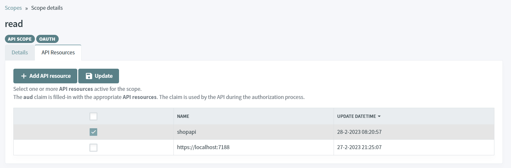

# Protect REST.API using ASP.NET CORE

> [!WARNING]
> Before you start, Make sure you have an [up and running IdentityServer and IdentityServer website](/documentation/gettingstarted/index.html).

## Validate JWT Token

In this tutorial, we are going to explain how to protect a REST.API using ASP.NET CORE.

The JWT Token passed in the `Authorization` header must be valided.

### Source Code

The source code of this project can be found [here](https://github.com/simpleidserver/SimpleIdServer/tree/master/samples/ProtectRESTApiJWT).

### Add a scope

The first step consists to configure a `read` scope associates with one API resource named `shopapi`.

* Open the IdentityServer website [http://localhost:5002](http://localhost:5002).
* In the Scopes screen, click on `Add scope` button.
* Select `API value` and click on next.


* Fill-in the form like this and click on the `Save` button to confirm the creation. 


* Click on the new scope, select the `API Resources` tab and click on the `Add API resource` button.
* Fill-in the form like this and click on the `Add` button to confirm the creation.


* In the table, select the `shopapi` resource and click on the `Update` button.



### Create REST.API

The last step consists to create and configure a REST.API project.

* Open a command prompt, run the following commands to create the directory structure for the solution.

```
mkdir ProtectRESTApiJWT
cd ProtectRESTApiJWT
mkdir src
dotnet new sln -n ProtectRESTApiJWT
```

* Create a REST.API project and install the `Microsoft.AspNetCore.Authentication.JwtBearer` Nuget Package

```
cd src
dotnet new webapi -n ShopApi
cd ShopApi
dotnet add package Microsoft.AspNetCore.Authentication.JwtBearer
```

* Add the `ShopApi` project into your Visual Studio solution.

```
cd ..\..
dotnet sln add ./src/ShopApi/ShopApi.csproj
```

* Edit the file `ShopApi\Program.cs`, configure the JWT authentication and add an Authorization policy named `read`, it checks if the scope is equals to `read`.

```
builder.Services.AddAuthentication(options =>
{
    options.DefaultChallengeScheme = JwtBearerDefaults.AuthenticationScheme;
})
    .AddJwtBearer(options =>
    {
        options.Authority = "http://localhost:5001";
        options.RequireHttpsMetadata = false;
        options.TokenValidationParameters = new TokenValidationParameters
        {
            ValidAudiences = new List<string>
            {
                "shopapi"
            },
            ValidIssuers = new List<string>
            {
                "http://localhost:5001"
            }
        };
    });
builder.Services.AddAuthorization(b =>
{
    b.AddPolicy("read", p => p.RequireClaim("scope", "read"));
});
```

Now your REST.API is configured, the controller or action can be decorate by the `AuthorizeAttribute` with the appropriate authorization policy.

For example, the attribute `[Authorization["read"]` checks if the JWT contains a scope equals to `read`.