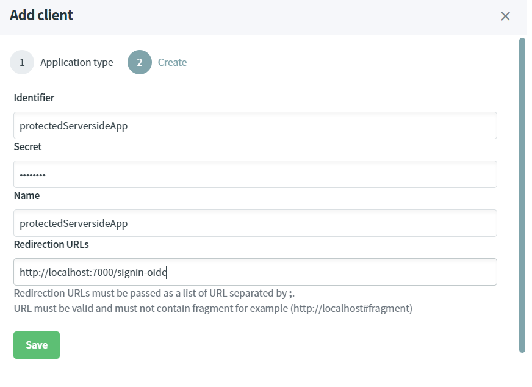
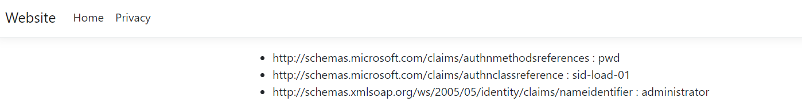

# Protect server-side application using ASP.NET CORE

Server-Side application must use **authorization code** grant-type.

> [!WARNING]
> Before you start, Make sure you have an [up and running IdentityServer and IdentityServer website](/documentation/gettingstarted/index.html).

## Source Code

The source code of this project can be found [here](https://github.com/simpleidserver/SimpleIdServer/tree/master/samples/ProtectWebsiteServerside).

## Add a client

The first step consists to configure the OPENID client.

* Open the IdentityServer website [http://localhost:5002](http://localhost:5002).
* In the Clients screen, click on `Add client` button.
* Select `web application` and click on next.


* Fill-in the form like this and click on the `Save` button to confirm the creation. The secret must be equals to `password`.



### Create ASP.NET CORE application

The last step consists to create and configure an ASP.NET CORE project.

* Open a command prompt, run the following commands to create the directory structure for the solution.

```
mkdir ProtectWebsiteServerside
cd ProtectWebsiteServerside
mkdir src
dotnet new sln -n ProtectWebsiteServerside
```

* Create a web project named `Website` and install the `Microsoft.AspNetCore.Authentication.OpenIdConnect` nuget package.

```
cd src
dotnet new mvc -n Website
cd Website
dotnet add package Microsoft.AspNetCore.Authentication.OpenIdConnect
```

* Add the `Website` project into your Visual Studio solution.

```
cd ..\..
dotnet sln add ./src/Website/Website.csproj
```

* Edit the `Program.cs` file and configure the OpenId authentication. 

```
builder.Services.AddAuthentication(options =>
{
    options.DefaultScheme = "Cookies";
    options.DefaultChallengeScheme = "sid";
})
    .AddCookie("Cookies")
    .AddOpenIdConnect("sid", options =>
    {
        options.SignInScheme = "Cookies";
        options.ResponseType = "code";
        options.Authority = "https://localhost:5001/master";
        options.RequireHttpsMetadata = false;
        options.ClientId = "protectedServersideApp";
        options.ClientSecret = "password";
        options.GetClaimsFromUserInfoEndpoint = true;
        options.SaveTokens = true;
    });
...
app.UseCookiePolicy(new CookiePolicyOptions
{
    Secure = CookieSecurePolicy.Always
});
app.UseHttpsRedirection();
app.UseStaticFiles();
app.UseRouting();
app.UseAuthorization();
...
```

* Add a `ClaimsController` controller with one protected operation.

```
public class ClaimsController : Controller
{
    [Authorize]
    public IActionResult Index()
    {
        return View();
    }
}
```

* Create a view `Views\Claims\Index.cshtml` with the following content. It will display all the claims of the authenticated user.

```
<ul>
    @foreach (var claim in User.Claims)
    {
        <li>@claim.Type : @claim.Value</li>
    }
</ul>
```

* In a command prompt, navigate to the directory `src\Website` and launch the application.

```
dotnet run --urls=http://localhost:7000
```

* Browse this URL [http://localhost:7000/claims](http://localhost:7000/claims), the User-Agent is automatically redirected to the OPENID server. 
  Submit the credentials - login : `administrator`, password : `password` and confirm the consent. You'll be redirected to the following screen where your claims will be displayed.

