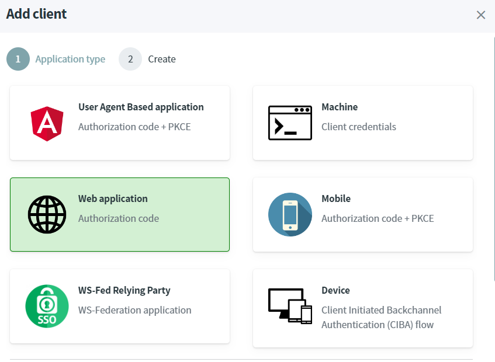
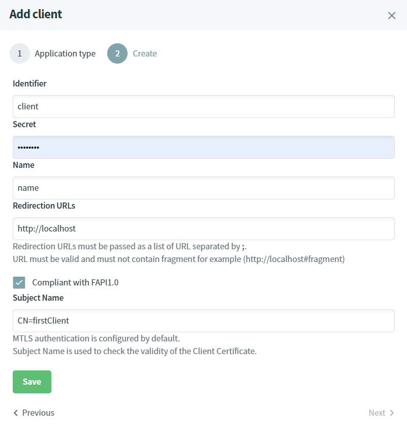

# Protect server-side application compliant with FAPI using ASP.NET CORE

In the SimpleIdServer Administration UI, a Server Side Application compliant with FAPI, for example an ASP.NET CORE website, can easily be created.

* Open the IdentityServer website [http://localhost:5002](http://localhost:5002).
* In the Clients screen, click on `Add client` button.
* Select `Web application` and click on next.

* Check the checkbox named `Compliant with FAPI1.0`, enter Subject Name of the Client Certificate, for example : `CN=firstClient`.

* Click on the `Save` button.

A new client is created, it is configured to use the `tls_client_auth` authentication method.

A client certificate can easily be generated in the `Certificate Authorities` Web Page.