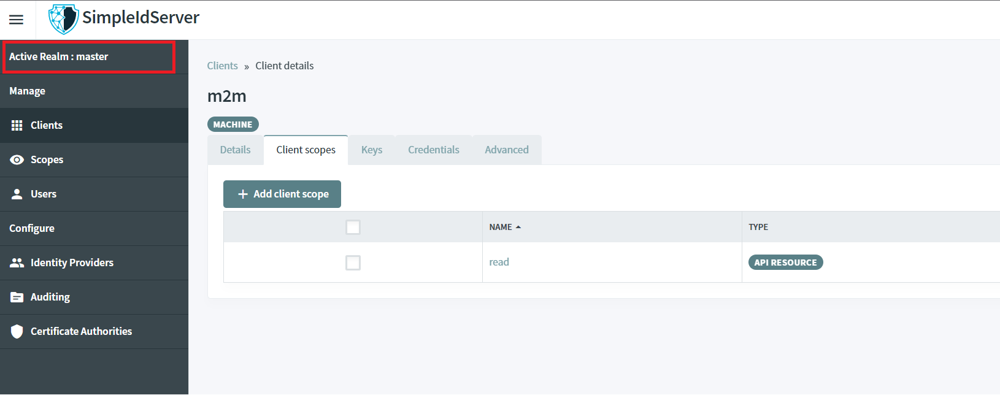

# Realm

A Realm is a space where you can manage Clients, Scopes, Users, Identity Providers and Certificate Authorities.
Realms are isolated from one another, but the same resource can be located in one or more Realm.

By default, there is one configured `master` realm.

In the Administration UI, a realm can easily be added. Click on `Active realm : master` and click on the button `Add realm`.

You will be redirected to a page, fill-in the form like this and click on the button `Add` to create a `test` realm.

`test` realm is now ready to be used. there are two OPENID configurations endpoints :
* master : [https://localhost:5001/master/.well-known/openid-configuration](https://localhost:5001/master/.well-known/openid-configuration).
* test: [https://localhost:5001/test/.well-known/openid-configuration](https://localhost:5001/test/.well-known/openid-configuration).

You can authenticate to both `realm` separately with the same `administrator` user.
* Browse the URL [https://localhost:5001/master](https://localhost:5001/master), authenticate as an administrator : login : `administrator`, password : `password`.
* Browse the URL [https://localhost:5001/test](https://localhost:5001/test), authenticate with the same credentials.

The user has two active sessions in two different `realm`.