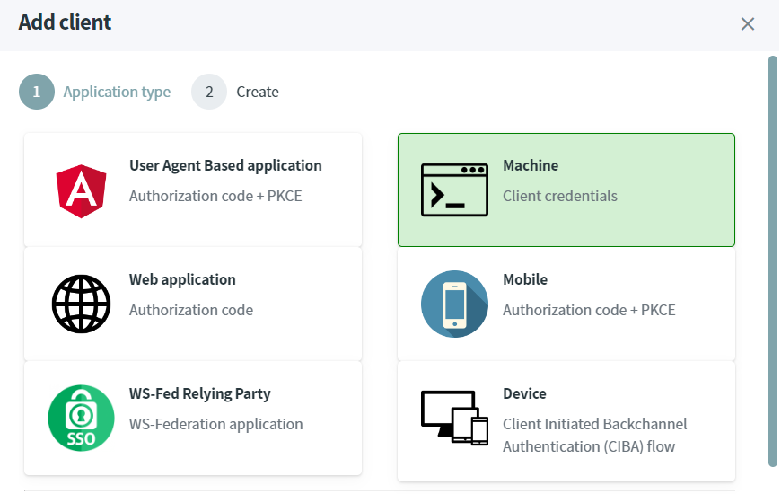

# Requesting token

> [!WARNING]
> Before you start, Make sure you have an [up and running IdentityServer and IdentityServer website](/documentation/gettingstarted/index.html).

## Machine to Machine (M2M) communication

In this scenario, an application with no user interaction (e.g. windows service, console application etc...) wants to call a REST.API.

The grant-type `client_credentials` will be used by our Console Application who wants to call a protected REST.API.

### Source Code

The source code of this project can be found [here](https://github.com/simpleidserver/SimpleIdServer/tree/master/samples/RequestAccessTokenM2M).

### Add a client

* Open the IdentityServer website [http://localhost:5002](http://localhost:5002).
* Ensures the scope `read` exists. If not, then follow the tutorial [Protect REST.API using ASP.NET CORE](/documentation/idserver/protectrestapi.html).
* Select `web application` and click on next.
* In the Clients screen, click on `Add client` button.



* Fill-in the form like this and click on the `Save` button to confirm the creation. The secret must be equals to `password`.


* Click on the new client, select the `Client scopes` tab and click on the `Add client scope` button. 
* In the `Add scopes` popup, select the `read` scope and click on the `Save` button.


### Create a console application

The last step consists to create and configure a Console Application project.

* Open a command prompt, run the following commands to create the directory structure for the solution.

```
mkdir RequestAccessTokenM2M
cd RequestAccessTokenM2M
mkdir src
dotnet new sln -n RequestAccessTokenM2M
```

* Create a console application named `ConsoleApp`.

```
cd src
dotnet new console -n ConsoleApp
```

* Add the `ConsoleApp` project into your Visual Studio solution.

```
cd ..
dotnet sln add ./src/ConsoleApp/ConsoleApp.csproj
```

* Edit the `Program.cs` file add copy the following code. An HTTP request is executed to get an Access Token.

```
using (var httpClient = new HttpClient())
{
    var form = new Dictionary<string, string>
    {
        { "grant_type", "client_credentials" },
        { "client_id", "m2m" },
        { "client_secret", "password" },
        { "scope", "read" }
    };
    var tokenResponse = httpClient.PostAsync("http://localhost:5001/token", new FormUrlEncodedContent(form)).Result;
    var json = tokenResponse.Content.ReadAsStringAsync().Result;
    System.Console.WriteLine(json);
}
```

When you run the Console Application, the Access Token will be displayed.