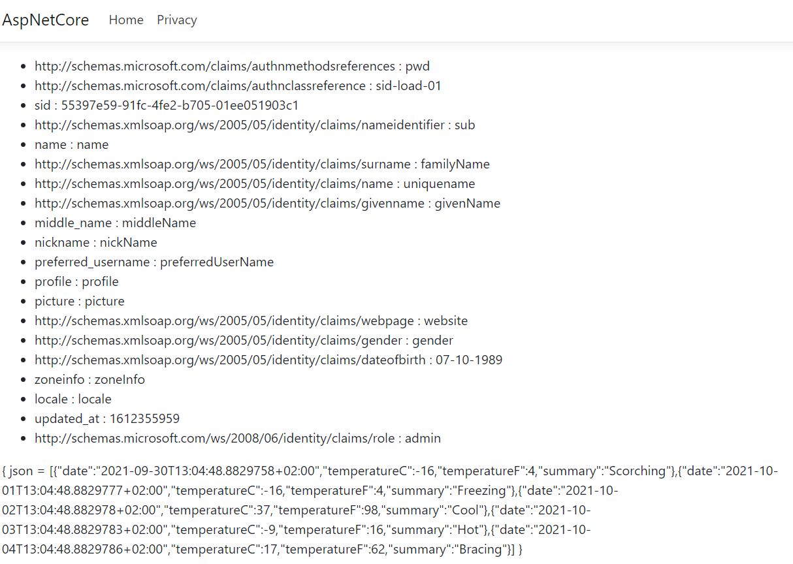

# Protect REST.API from undeseriable users

There are two different mechanisms to protect REST.API from undesirable users :

* **Check Identity Token** : Check the identity token and fetch the claims from it.
* **Get claims from UserInfo endpoint** : Use the access token to get the claims from the UserInfo Endpoint.

The first method can be used when the `response_type` parameter is equals to `id_token`. Otherwise the claims requested by the `profile`,`email`,`address`,`scope` and `role` scope values are returned from the UserInfo endpoint.

| response_type parameter | API Protection                    |
| ----------------------- | --------------------------------- |
| id_token                | Check id_token                    |
| token                   | Get claims from UserInfo endpoint |
| token id_token          | Get claims from UserInfo endpoint |

## Protect REST.API from invalid Identity Token

This tutorial explains how to protect a REST.API from undesirable identity token.

> [!WARNING]
> Before you start, Make sure there is a Visual Studio Solution with a [configured OpenId server](/documentation/openid/installation.html).

### Source Code

The source code of this project can be found [here](https://github.com/simpleidserver/SimpleIdServer/tree/master/samples/ProtectAPIFromUndesirableUsers/IdToken).

### Configure OpenId Server

The first step consists to configure the OPENID client.

* Open the Visual Studio Solution and edit the `OpenIdDefaultConfiguration.cs` file.
* Assign admin `role` to the user :

```
new UserClaim(SimpleIdServer.Jwt.Constants.UserClaims.Role, "admin")
```

* Add a new OpenId client :

```
new OpenIdClient
{
    ClientId = "website",
    ClientSecret = "websiteSecret",
    ApplicationKind = ApplicationKinds.Web,
    TokenEndPointAuthMethod = "client_secret_post",
    ApplicationType = "web",
    UpdateDateTime = DateTime.UtcNow,
    CreateDateTime = DateTime.UtcNow,
    TokenExpirationTimeInSeconds = 60 * 30,
    RefreshTokenExpirationTimeInSeconds = 60 * 30,
    TokenSignedResponseAlg = "RS256",
    IdTokenSignedResponseAlg = "RS256",
    AllowedScopes = new List<OAuthScope>
    {
        SIDOpenIdConstants.StandardScopes.OpenIdScope,
        SIDOpenIdConstants.StandardScopes.Profile,
        SIDOpenIdConstants.StandardScopes.Email,
        SIDOpenIdConstants.StandardScopes.Role
    },
    GrantTypes = new List<string>
    {
        "authorization_code",
    },
    RedirectionUrls = new List<string>
    {
        "https://localhost:7001/signin-oidc"
    },
    PreferredTokenProfile = "Bearer",
    ResponseTypes = new List<string>
    {
        "token",
        "id_token"
    }
}
```

* Run the OPENID server.

```
cd src\OpenId
dotnet run
```

### Create REST.API service

The second step consists to create and protect a REST.API service.

* Open a command and navigate to the `src` subfolder of your project.
* Create a directory `WebApi` and create an ASP.NET CORE Web API project in it :

```
mkdir WebApi

dotnet new webapi -n WebApi
```

* Navigate to the directory `WebApi` and install the Nuget package `Microsoft.AspNetCore.Authentication.JwtBearer`. It will be used to check received identity tokens.

```
cd WebApi

dotnet add package Microsoft.AspNetCore.Authentication.JwtBearer
```

* Add the `WebApi` project into your Visual Studio solution.

```
cd ..\..
dotnet sln add ./src/WebApi/WebApi.csproj
```

* Edit the `Controllers\WeatherForecastController.cs` and decorate the `Get()` operation with `Authorize` attribute.

```
[HttpGet]
[Authorize("IsAdmin")]
public IEnumerable<WeatherForecast> Get()
{
    var rng = new Random();
    return Enumerable.Range(1, 5).Select(index => new WeatherForecast
    {
        Date = DateTime.Now.AddDays(index),
        TemperatureC = rng.Next(-20, 55),
        Summary = Summaries[rng.Next(Summaries.Length)]
    })
    .ToArray();
}
```

* Edit the `Startup.cs` file and configure the authentication. Copy the following content in the `ConfigureServices` method. The `TokenValidationParameters` class contains important properties used during identity token validation.

  * **IssuerSigningKey** : Certificate public key used to check the signature of the identity token. Exponent and modulus are part of the public key.
  * **ValidIssuer** : URL of the OPENID server.
  * **ValidAudiences** : List of authorized client identifiers.

```
public void ConfigureServices(IServiceCollection services)
{
    const string modulus = "7jyP7WVsRx9WRj/nvLODxpfWrqtITHtssFc6DC8+FBjwcUAsJE+BOiwbGFoMN6aFgnug3T+EWb4g6UcBrkLlLMNhLLAnE1MvvO5elsaTmIdRNaRKq5W2N1nYZM/Ad17gV5XoXsr82Zl92tHHSbhRTRYIAWUevXA8IOMEw+Q1TeBtIGGAjweclkliNb2T69PitHC4AD1CjuHkrEO7LbmZgfsj+F/RjnD+/6MJ0E9KSiJPJ0RFxzsC72NR2uquDDOBxWluUEgXRFgqd1s/D/t/FehPEgfc5Iy88xOQkD/k3SN8xqeopaZD8OdMwxdGNMjwyD5cw80jlH0lXRLTYK0aiQ==";
    const string exponent = "AQAB";
    var rsaParameters = new RSAParameters
    {
        Modulus = Convert.FromBase64String(modulus),
        Exponent = Convert.FromBase64String(exponent)
    };
    var oauthRsaSecurityKey = new RsaSecurityKey(rsaParameters);
    services.AddAuthentication(JwtBearerDefaults.AuthenticationScheme)
        .AddJwtBearer(cfg =>
        {
            cfg.TokenValidationParameters = new TokenValidationParameters
            {
                ValidIssuer = "http://localhost:5000",
                ValidAudiences = new List<string>
                {
                    "website"
                },
                ValidateIssuerSigningKey = true,
                IssuerSigningKey = oauthRsaSecurityKey
            };
        });
    services.AddAuthorization(o => o.AddPolicy("IsAdmin", p => p.RequireClaim(ClaimTypes.Role, "admin")));
    services.AddControllers();
    services.AddSwaggerGen(c =>
    {
        c.SwaggerDoc("v1", new OpenApiInfo { Title = "WebApi", Version = "v1" });
    });
}
```

* In the `Configure` procedure add the following statement to enable the authentication.

```
app.UseAuthentication();
```

* In a command prompt, navigate to the directory `src\WebApi` and run the application under the port `7000`.

```
dotnet run --urls=https://localhost:7000
```

### Create ASP.NET CORE application

The last step consists to create and configure an ASP.NET CORE project.

* Open a command and navigate to the `src` subfolder of your project.
* Create a directory `AspNetCore` and create an ASP.NET CORE project in it :

```
mkdir AspNetCore

dotnet new mvc -n AspNetCore
```

* Navigate to the directory `AspNetCore` and install the Nuget package `Microsoft.AspNetCore.Authentication.OpenIdConnect`.

```
cd AspNetCore

dotnet add package Microsoft.AspNetCore.Authentication.OpenIdConnect
```

* Add the `AspNetCore` project into your Visual Studio solution.

```
cd ..\..
dotnet sln add ./src/AspNetCore/AspNetCore.csproj
```

* Edit the `Startup.cs` file and configure the OpenId authentication. In the `ConfigureServices` procedure, add the following code :

```
services.AddAuthentication(options =>
{
    options.DefaultScheme = "Cookies";
    options.DefaultChallengeScheme = "sid";
})
   .AddCookie("Cookies")
   .AddOpenIdConnect("sid", options =>
   {
       options.SignInScheme = "Cookies";

       options.Authority = "http://localhost:5000";
       options.RequireHttpsMetadata = false;
       options.ResponseType = "id_token";
       options.ClientId = "website";
       options.Scope.Add("role");
       options.SaveTokens = true;
   });
```

* To ensure the authentication service execute on each request, add `UseAuthentication` in the `Configure` procedure. The procedure should look like to something like this :

```
public void Configure(IApplicationBuilder app, IWebHostEnvironment env)
{
    app.UseHttpsRedirection();
    app.UseStaticFiles();
    
    app.UseRouting();
    
    app.UseAuthentication();
    app.UseAuthorization();
    
    app.UseEndpoints(endpoints =>
    {
        endpoints.MapControllerRoute(
            name: "default",
            pattern: "{controller=Home}/{action=Index}/{id?}");
    });
}
```

* Add a `ClaimsController` with one protected operation. It will call the protected API operation and return the result to the view. The identity token is passed into the `Authorization` header of the HTTP GET request.

```
[Authorize]
public async Task<IActionResult> Index()
{
    var authenticateInfo = await HttpContext.AuthenticateAsync("sid");
    var idToken = authenticateInfo.Properties.Items[".Token.id_token"];
    using (var client = new HttpClient())
    {
        var request = new HttpRequestMessage
        {
            RequestUri = new System.Uri("https://localhost:7000/WeatherForecast"),
            Method = HttpMethod.Get
        };
        request.Headers.Add("Authorization", $"Bearer {idToken}");
        var httpResult = await client.SendAsync(request);
        var json = await httpResult.Content.ReadAsStringAsync();
        return View(new { json = json });
    }
}
```

* Create a new view `Views\Claims\Index.cshtml`. It will display all the claims of the authenticated user and the JSON returned by the API call.

```
@model object

<ul>
    @foreach (var claim in User.Claims)
    {
        <li>@claim.Type : @claim.Value</li>
    }
</ul>

<p>@Model</p>
```

* In a command prompt, navigate to the directory `src\AspNetCore` and run the application under the port `7001`.

```
dotnet run --urls=https://localhost:7001
```

* Browse this URL [https://localhost:7001/claims](https://localhost:7001/claims), the User-Agent is automatically redirected to the OPENID server. 
* Submit the credentials - login : `sub`, password : `password` and confirm the consent. You'll be redirected to the following screen where your claims will be displayed.



## Protect REST.API from invalid Access Token

This tutorial explains how to protect a REST.API from undesirable access token.

> [!WARNING]
> Before you start, Make sure there is a Visual Studio Solution with a [configured OpenId server](/documentation/openid/installation.html).

### Source Code

The source code of this project can be found [here](https://github.com/simpleidserver/SimpleIdServer/tree/master/samples/ProtectAPIFromUndesirableUsers/AccessToken).

### Configure OpenId Server

The first step consists to configure the OPENID client.

* Open the Visual Studio Solution and edit the `OpenIdDefaultConfiguration.cs` file.
* Assign admin `role` to the user :

```
new UserClaim(SimpleIdServer.Jwt.Constants.UserClaims.Role, "admin")
```

* Add a new OpenId client :

```
new OpenIdClient
{
    ClientId = "website",
    ClientSecret = "websiteSecret",
    ApplicationKind = ApplicationKinds.Web,
    TokenEndPointAuthMethod = "client_secret_post",
    ApplicationType = "web",
    UpdateDateTime = DateTime.UtcNow,
    CreateDateTime = DateTime.UtcNow,
    TokenExpirationTimeInSeconds = 60 * 30,
    RefreshTokenExpirationTimeInSeconds = 60 * 30,
    TokenSignedResponseAlg = "RS256",
    IdTokenSignedResponseAlg = "RS256",
    AllowedScopes = new List<OAuthScope>
    {
        SIDOpenIdConstants.StandardScopes.OpenIdScope,
        SIDOpenIdConstants.StandardScopes.Profile,
        SIDOpenIdConstants.StandardScopes.Email,
        SIDOpenIdConstants.StandardScopes.Role
    },
    GrantTypes = new List<string>
    {
        "authorization_code",
    },
    RedirectionUrls = new List<string>
    {
        "https://localhost:7001/signin-oidc"
    },
    PreferredTokenProfile = "Bearer",
    ResponseTypes = new List<string>
    {
        "token",
        "id_token"
    }
}
```

* Run the OPENID server.

```
cd src\OpenId
dotnet run
```

### Create REST.API service

The second step consists to create and protect a REST.API service.

* Open a command and navigate to the `src` subfolder of your project.
* Create a directory `WebApi` and create an ASP.NET CORE Web API project in it :

```
mkdir WebApi

dotnet new webapi -n WebApi
```

* Navigate to the directory `WebApi` and install the Nuget package `Microsoft.AspNetCore.Authentication.JwtBearer`. It will be used to check received identity tokens.

```
cd WebApi

dotnet add package Microsoft.AspNetCore.Authentication.JwtBearer
```

* Add the `WebApi` project into your Visual Studio solution.

```
cd ..\..
dotnet sln add ./src/WebApi/WebApi.csproj
```

* Edit the `Controllers\WeatherForecastController.cs` and decorate the `Get()` operation with `Authorize` attribute.

```
[HttpGet]
[Authorize("IsAdmin")]
public IEnumerable<WeatherForecast> Get()
{
    var rng = new Random();
    return Enumerable.Range(1, 5).Select(index => new WeatherForecast
    {
        Date = DateTime.Now.AddDays(index),
        TemperatureC = rng.Next(-20, 55),
        Summary = Summaries[rng.Next(Summaries.Length)]
    })
    .ToArray();
}
```

* Edit the `Startup.cs` file and configure the authentication. Copy the following content in the `ConfigureServices` method.  The `TokenValidationParameters` class contains important properties used during identity token validation.

  * **IssuerSigningKey** : Certificate public key used to check the signature of the identity token. Exponent and modulus are part of the public key.
  * **ValidIssuer** : URL of the OPENID server.
  * **ValidAudiences** : List of authorized client identifiers.
  * **Events.OnTokenValidated** : The access token is extracted from the `Authorization` header and used to get the claims from the UserInfo endpoint.

```
public void ConfigureServices(IServiceCollection services)
{
    const string modulus = "7jyP7WVsRx9WRj/nvLODxpfWrqtITHtssFc6DC8+FBjwcUAsJE+BOiwbGFoMN6aFgnug3T+EWb4g6UcBrkLlLMNhLLAnE1MvvO5elsaTmIdRNaRKq5W2N1nYZM/Ad17gV5XoXsr82Zl92tHHSbhRTRYIAWUevXA8IOMEw+Q1TeBtIGGAjweclkliNb2T69PitHC4AD1CjuHkrEO7LbmZgfsj+F/RjnD+/6MJ0E9KSiJPJ0RFxzsC72NR2uquDDOBxWluUEgXRFgqd1s/D/t/FehPEgfc5Iy88xOQkD/k3SN8xqeopaZD8OdMwxdGNMjwyD5cw80jlH0lXRLTYK0aiQ==";
    const string exponent = "AQAB";
    var rsaParameters = new RSAParameters
    {
        Modulus = Convert.FromBase64String(modulus),
        Exponent = Convert.FromBase64String(exponent)
    };
    var oauthRsaSecurityKey = new RsaSecurityKey(rsaParameters);
    var mapping = new Dictionary<string, string>
    {
        { "sub", ClaimTypes.NameIdentifier },
        { "role", ClaimTypes.Role }
    };
    services.AddAuthentication(JwtBearerDefaults.AuthenticationScheme)
        .AddJwtBearer(cfg =>
        {
            cfg.Events = new JwtBearerEvents
            {
                OnTokenValidated = async (ctx) =>
                {
                    using (var httpClient = new HttpClient())
                    {
                        var authorization = ctx.Request.Headers["Authorization"][0];
                        var bearer = authorization.Split(" ").Last();
                        var requestMessage = new HttpRequestMessage
                        {
                            RequestUri = new Uri("http://localhost:5000/userinfo"),
                            Method = HttpMethod.Get
                        };
                        requestMessage.Headers.Add("Authorization", $"Bearer {bearer}");
                        var httpResponse = await httpClient.SendAsync(requestMessage);
                        var json = await httpResponse.Content.ReadAsStringAsync();
                        var jObj = JsonDocument.Parse(json);
                        var identity = new ClaimsIdentity("userInfo");
                        var props = jObj.RootElement.EnumerateObject();
                        while(props.MoveNext())
                        {
                            var kvp = props.Current;
                            var key = kvp.Name;
                            if (mapping.ContainsKey(key))
                            {
                                key = mapping[key];
                            }

                            identity.AddClaim(new Claim(key, kvp.Value.GetString()));
                        }

                        var principal = new ClaimsPrincipal(identity);
                        ctx.Principal = principal;
                    }
                }
            };
            cfg.TokenValidationParameters = new TokenValidationParameters
            {
                ValidIssuer = "http://localhost:5000",
                ValidAudiences = new List<string>
                {
                    "website"
                },
                ValidateIssuerSigningKey = true,
                IssuerSigningKey = oauthRsaSecurityKey
            };
        });
    services.AddAuthorization(o => o.AddPolicy("IsAdmin", p => p.RequireClaim(ClaimTypes.Role, "admin")));
    services.AddControllers();
    services.AddSwaggerGen(c =>
    {
        c.SwaggerDoc("v1", new OpenApiInfo { Title = "WebApi", Version = "v1" });
    });
}
```

* In the `Configure` procedure add the following statement to enable the authentication.

```
app.UseAuthentication();
```

* In a command prompt, navigate to the directory `src\WebApi` and run the application under the port `7000`.

```
dotnet run --urls=https://localhost:7000
```

### Create ASP.NET CORE application

The last step consists to create and configure an ASP.NET CORE project.

* Open a command and navigate to the `src` subfolder of your project.
* Create a directory `AspNetCore` and create an ASP.NET CORE project in it :

```
mkdir AspNetCore

dotnet new mvc -n AspNetCore
```

* Navigate to the directory `AspNetCore` and install the Nuget package `Microsoft.AspNetCore.Authentication.OpenIdConnect`.

```
cd AspNetCore

dotnet add package Microsoft.AspNetCore.Authentication.OpenIdConnect
```

* Add the `AspNetCore` project into your Visual Studio solution.

```
cd ..\..
dotnet sln add ./src/AspNetCore/AspNetCore.csproj
```

* Edit the `Startup.cs` file and configure the OpenId authentication. In the `ConfigureServices` procedure, add the following code :

```
services.AddAuthentication(options =>
{
    options.DefaultScheme = "Cookies";
    options.DefaultChallengeScheme = "sid";
})
   .AddCookie("Cookies")
   .AddOpenIdConnect("sid", options =>
   {
       options.SignInScheme = "Cookies";

       options.Authority = "http://localhost:5000";
       options.RequireHttpsMetadata = false;
       options.ResponseType = "id_token token";
       options.ClientId = "website";
       options.Scope.Add("role");
       options.SaveTokens = true;
   });
```

* To ensure the authentication service execute on each request, add `UseAuthentication` in the `Configure` procedure. The procedure should look like to something like this :

```
public void Configure(IApplicationBuilder app, IWebHostEnvironment env)
{
    app.UseHttpsRedirection();
    app.UseStaticFiles();
    
    app.UseRouting();
    
    app.UseAuthentication();
    app.UseAuthorization();
    
    app.UseEndpoints(endpoints =>
    {
        endpoints.MapControllerRoute(
            name: "default",
            pattern: "{controller=Home}/{action=Index}/{id?}");
    });
}
```

* Add a `ClaimsController` with one protected operation. It will call the protected API operation and return the result to the view. The identity token is passed into the `Authorization` header of the HTTP GET request.

```
[Authorize]
public async Task<IActionResult> Index()
{
    var authenticateInfo = await HttpContext.AuthenticateAsync("sid");
    var idToken = authenticateInfo.Properties.Items[".Token.access_token"];
    using (var client = new HttpClient())
    {
        var request = new HttpRequestMessage
        {
            RequestUri = new System.Uri("https://localhost:7000/WeatherForecast"),
            Method = HttpMethod.Get
        };
        request.Headers.Add("Authorization", $"Bearer {idToken}");
        var httpResult = await client.SendAsync(request);
        var json = await httpResult.Content.ReadAsStringAsync();
        return View(new { json = json });
    }
}
```

* Create a new view `Views\Claims\Index.cshtml`. It will display all the claims of the authenticated user and the JSON returned by the API call.

```
@model object

<ul>
    @foreach (var claim in User.Claims)
    {
        <li>@claim.Type : @claim.Value</li>
    }
</ul>

<p>@Model</p>
```

* In a command prompt, navigate to the directory `src\AspNetCore` and run the application under the port `7001`.

```
dotnet run --urls=https://localhost:7001
```

* Browse this URL [https://localhost:7001/claims](https://localhost:7001/claims), the User-Agent is automatically redirected to the OPENID server. 
* Submit the credentials - login : `sub`, password : `password` and confirm the consent. You'll be redirected to the following screen where your claims will be displayed.

