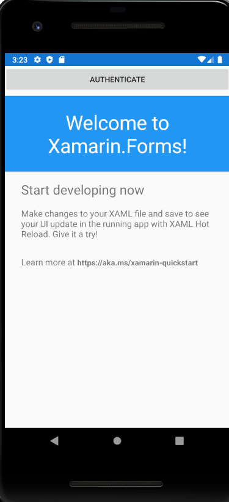
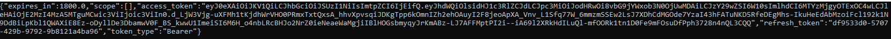

# Protect application from undesirable users

An OPENID server can be used to protect any type of applications from undesirable users.
Following chapters describe how to implement user authentication for each type of application.

## Recommended flow by application type

There are different grant-types to get tokens, the choice depends on the type of application.


| Applications                                 | Recommended Configuration                                                    |
| -------------------------------------------- | ---------------------------------------------------------------------------- |
| Server-Side (Web application) - ASP.NET CORE | **Grant-Type** : authorization code                                          |
| Single Page Application (SPA) - Angular      | **Grant-Type** : authorization code, **Client Authentication Method** : PKCE |
| Native - Mobile, WPF application             | **Grant-Type** : authorization code, **Client Authentication Method** : PKCE |
| Trusted                                      | **Grant-Type** : password                                                    |

## Server-Side application

**Example** : ASP.NET CORE application.

Server-Side application should use **authorization code** grant-type.

> [!WARNING]
> Before you start, Make sure there is a Visual Studio Solution with a [configured OpenId server](/documentation/openid/installation.html).
	
### Source Code

The source code of this project can be found [here](https://github.com/simpleidserver/SimpleIdServer/tree/master/samples/ProtectApplicationFromUndesirableUsers/AspNetCore).
 
### Configure OpenId Server

The first step consists to configure the OPENID client.

* Open the Visual Studio Solution and edit the `OpenIdDefaultConfiguration.cs` file.
* Add a new OpenId client :

```
new OpenIdClient
{
    ClientId = "website",
    ClientSecret = "websiteSecret",
    ApplicationKind = ApplicationKinds.Web,
    TokenEndPointAuthMethod = "client_secret_post",
    ApplicationType = "web",
    UpdateDateTime = DateTime.UtcNow,
    CreateDateTime = DateTime.UtcNow,
    TokenExpirationTimeInSeconds = 60 * 30,
    RefreshTokenExpirationTimeInSeconds = 60 * 30,
    TokenSignedResponseAlg = "RS256",
    IdTokenSignedResponseAlg = "RS256",
    AllowedScopes = new List<OAuthScope>
    {
        SIDOpenIdConstants.StandardScopes.OpenIdScope,
        SIDOpenIdConstants.StandardScopes.Profile,
        SIDOpenIdConstants.StandardScopes.Email
    },
    GrantTypes = new List<string>
    {
        "authorization_code",
    },
    RedirectionUrls = new List<string>
    {
        "https://localhost:7000/signin-oidc"
    },
    PreferredTokenProfile = "Bearer",
    ResponseTypes = new List<string>
    {
        "token",
        "id_token"
    }
}
```

* Run the OPENID server.

```
cd src\OpenId
dotnet run
```

### Create ASP.NET CORE application

The last step consists to create and configure an ASP.NET CORE project.

* Open a command and navigate to the `src` subfolder of your project.
* Create a directory `AspNetCore` and create an ASP.NET CORE project in it :

```
mkdir AspNetCore

dotnet new mvc -n AspNetCore
```

* Navigate to the directory `AspNetCore` and install the Nuget package `Microsoft.AspNetCore.Authentication.OpenIdConnect`.

```
cd AspNetCore

dotnet add package Microsoft.AspNetCore.Authentication.OpenIdConnect
```

* Add the `AspNetCore` project into your Visual Studio solution.

```
cd ..\..
dotnet sln add ./src/AspNetCore/AspNetCore.csproj
```

* Edit the `Startup.cs` file and configure the OpenId authentication. In the `ConfigureServices` procedure, add the following code :

```
services.AddAuthentication(options =>
{
    options.DefaultScheme = "Cookies";
    options.DefaultChallengeScheme = "sid";
})
    .AddCookie("Cookies")
    .AddOpenIdConnect("sid", options =>
    {
        options.SignInScheme = "Cookies";

        options.Authority = "http://localhost:5000";
        options.RequireHttpsMetadata = false;

        options.ClientId = "website";
        options.SaveTokens = true;
    });
```

* To ensure the authentication service execute on each request, add `UseAuthentication` in the `Configure` procedure. The procedure should look like to something like this :

```
public void Configure(IApplicationBuilder app, IWebHostEnvironment env)
{
	app.UseHttpsRedirection();
	app.UseStaticFiles();
	
	app.UseRouting();
	
	app.UseAuthentication();
	app.UseAuthorization();
	
	app.UseEndpoints(endpoints =>
	{
		endpoints.MapControllerRoute(
			name: "default",
			pattern: "{controller=Home}/{action=Index}/{id?}");
	});
}
```

* Add a `ClaimsController` with one protected operation :

```
public class ClaimsController : Controller
{
    [Authorize]
    public IActionResult Index()
    {
        return View();
    }
}
```

* Create a new view `Views\Claims\Index.cshtml`. It will display all the claims of the authenticated user.

```
<ul>
    @foreach (var claim in User.Claims)
    {
        <li>@claim.Type : @claim.Value</li>
    }
</ul>
```

* In a command prompt, navigate to the directory `src\AspNetCore` and run the application under the port `7000`.

```
dotnet run --urls=https://localhost:7000
```

* Browse this URL [https://localhost:7000/claims](https://localhost:7000/claims), the User-Agent is automatically redirected to the OPENID server. 
  Submit the credentials - login : `sub`, password : `password` and confirm the consent. You'll be redirected to the following screen where your claims will be displayed.


## Single Page Application (SPA)

**Example**: Angular application.

SPA application use **authorization code** grant-type with **PKCE** client authentication method.

> [!WARNING]
> Before you start, Make sure there is a Visual Studio Solution with a [configured OpenId server](/documentation/openid/installation.html).
	
### Source Code

The source code of this project can be found [here](https://github.com/simpleidserver/SimpleIdServer/tree/master/samples/ProtectApplicationFromUndesirableUsers/Spa).
 
### Configure OpenId Server

The first step consists to configure the OPENID client.

* Open the Visual Studio solution and edit `OpenIdDefaultConfiguration.cs` file.
* Add a new OpenId client:

```
new OpenIdClient
{
    ClientId = "website",
    ClientSecret = "websiteSecret",
    ApplicationKind = ApplicationKinds.SPA,
    TokenEndPointAuthMethod = "pkce",
    ApplicationType = "web",
    UpdateDateTime = DateTime.UtcNow,
    CreateDateTime = DateTime.UtcNow,
    TokenExpirationTimeInSeconds = 60 * 30,
    RefreshTokenExpirationTimeInSeconds = 60 * 30,
    TokenSignedResponseAlg = "RS256",
    IdTokenSignedResponseAlg = "RS256",
    AllowedScopes = new List<OAuthScope>
    {
        SIDOpenIdConstants.StandardScopes.OpenIdScope,
        SIDOpenIdConstants.StandardScopes.Profile,
        SIDOpenIdConstants.StandardScopes.Email,
        SIDOpenIdConstants.StandardScopes.Role
    },
    GrantTypes = new List<string>
    {
        "authorization_code"
    },
    RedirectionUrls = new List<string>
    {
        "http://localhost:4200"
    },
    PreferredTokenProfile = "Bearer",
    ResponseTypes = new List<string>
    {
        "token",
        "id_token",
        "code"
    }
}
```

* Run the OPENID server.

```
cd src\OpenId
dotnet run
```

### Create angular application

The last step consists to create and configure an Angular project.

* Open a command prompt and navigate to the `src` subfolder of your project.
* Create an ASP.NET CORE with angular project, its name must be `Spa`.

```
mkdir Spa

dotnet new angular -n Spa
```

* Navigate to the directory `Spa\ClientApp` and install the npm package `angular-oauth2-oidc`.

```
cd Spa\ClientApp

npm i angular-oauth2-oidc --save
```

* Add the `Spa` project into your Visual Studio solution.

```
cd ..\..\..
dotnet sln add ./src/Spa/Spa.csproj
```

* Edit the file `ClientApp\src\app\app.module.ts` and import the `OAuthModule` module.

```
@NgModule({
  declarations: [
	// etc.
  ],
  imports: [
	// etc.
    OAuthModule.forRoot()
  ],
  providers: [],
  bootstrap: []
})
export class AppModule { }
```

* Create an `auth-config.ts` file in the directory `ClientApp\src\app`, replace its content with the following code. This file contains the authentication settings : Url of the identity provider or the Client Identifier.

```
import { AuthConfig } from 'angular-oauth2-oidc';

export const authCodeFlowConfig: AuthConfig = {
  issuer: 'http://localhost:5000',
  redirectUri: window.location.origin,
  clientId: 'website',
  responseType: 'code',
  scope: 'openid profile email role',
  showDebugInformation: true,
};
```

* Edit the `ClientApp\src\app\nav-menu\nav-menu.component.ts` file, import the `authCodeFlowConfig` JSON object, inject the `OAuthService` into the constructor and add a `login` procedure. This procedure will be called to initiate the authentication workflow.

```
import { OAuthService } from 'angular-oauth2-oidc';
import { authCodeFlowConfig } from '../auth-config';

@Component({
  selector: 'app-nav-menu',
  templateUrl: './nav-menu.component.html',
  styleUrls: ['./nav-menu.component.css']
})
export class NavMenuComponent {  
  isConnected: boolean = false;
  name: string;

  constructor(private oauthService: OAuthService) {
    this.oauthService.configure(authCodeFlowConfig);
    this.oauthService.loadDiscoveryDocumentAndTryLogin();
    var claims: any = this.oauthService.getIdentityClaims();
    if (!claims) {
      return;
    }

    this.isConnected = true;
    this.name = claims["sub"];
  }

  login(evt: any) {
    evt.preventDefault();
    this.oauthService.initImplicitFlow();
  }
}
```

* Edit the `ClientApp\src\app\nav-menu\nav-menu.component.html` file and add a login button.

```
<li class="nav-item" *ngIf="!isConnected">
  <a class="nav-link text-dark" (click)="login($event)">Authenticate</a>
</li>
<li class="nav-item" *ngIf="isConnected">
  <a class="nav-link text-dark">Welcome {{name}}</a>
</li>
```

* In a command prompt, navigate to the `src\Spa` directory and launch the project.

```
dotnet run --urls=http://localhost:4200
```

* Navigate to the website [http://localhost:4200](http://localhost:4200) and authenticate with the login : `sub` and password : `password`.


## Native application

**Examples** : WPF, Xamarin application etc...

Native application use **authorization code** grant-type with **PKCE** client authentication method.

> [!WARNING]
> Before you start, Make sure there is a Visual Studio Solution with a [configured OpenId server](/documentation/openid/installation.html).
	
### Source Code

The source code of this project can be found [here](https://github.com/simpleidserver/SimpleIdServer/tree/master/samples/ProtectApplicationFromUndesirableUsers/Native).
 
### Configure OpenId Server

The first step consists to configure the OPENID client.

* Open the Visual Studio Solution and edit the `OpenIdDefaultConfiguration.cs` file.
* Add a new OpenId client :

```
new OpenIdClient
{
    ClientId = "nativeXamarin",
    ClientSecret = "nativeXamarinSecret",
    ApplicationKind = ApplicationKinds.Native,
    TokenEndPointAuthMethod = "pkce",
    ApplicationType = "web",
    UpdateDateTime = DateTime.UtcNow,
    CreateDateTime = DateTime.UtcNow,
    TokenExpirationTimeInSeconds = 60 * 30,
    RefreshTokenExpirationTimeInSeconds = 60 * 30,
    TokenSignedResponseAlg = "RS256",
    IdTokenSignedResponseAlg = "RS256",
    AllowedScopes = new List<OAuthScope>
    {
        SIDOpenIdConstants.StandardScopes.OpenIdScope,
        SIDOpenIdConstants.StandardScopes.Profile,
        SIDOpenIdConstants.StandardScopes.Email
    },
    GrantTypes = new List<string>
    {
        "authorization_code"
    },
    RedirectionUrls = new List<string>
    {
        "com.companyname.native:/oauth2redirect"
    },
    PreferredTokenProfile = "Bearer",
    ResponseTypes = new List<string>
    {
        "code"
    }
}
```

* Run the OPENID server.

```
cd src\OpenId
dotnet run --urls=http://*:5000;https://*:5001
```

### Create a Xamarin application

The last step consists to create and configure a xamarin project.

* Open the `QuickStart` Visual Studio Solution.
* Create an empty Mobile Application (Xamarin Forms) project. Its name must be `Native`.
* In the `Native` project, add a new `AuthInfo` class. This class will be used by the `ILoginProvider` interface to return the authentication result.

```
public class AuthInfo
{
    public bool IsAuthorized { get; set; }
    public string AccessToken { get; set; }
    public string RefreshToken { get; set; }
    public string Scope { get; set; }
    public string IdToken { get; set; }
}
```
 
* In the `Native` project, add a new `ILoginProvider` interface with one function `LoginAsync`.

```
public interface ILoginProvider
{
    Task<AuthInfo> LoginAsync();
}
```

* Add the nuget package `Xamarin.Android.Support.v4` into the `Native.Android` project.
* Add the nuget package `Xamarin.Android.Support.CustomTabs` into the `Native.Android` project.
* Edit the `Nuget.Android` project and add the following line inside the `PropertyGroup` element.

```
<AndroidManifestPlaceholders>appAuthRedirectScheme=''</AndroidManifestPlaceholders>
```

* Edit the Android Manifest, set the package name to `com.companyname.nativexamarin` and add the activity below inside the `application` element.

```
<activity android:name="net.openid.appauth.RedirectUriReceiverActivity">
  <intent-filter>
    <action android:name="android.intent.action.VIEW" />
    <category android:name="android.intent.category.DEFAULT" />
    <category android:name="android.intent.category.BROWSABLE" />
    <data android:scheme="com.companyname.nativexamarin"/>
  </intent-filter>
</activity>
```

* Add the nuget package `Xamarin.OpenId.AppAuth.Android` into the `Native.Android` project. This Nuget package is a client SDK for communicating with OAUTH2.0 and OPENID connect providers. 
* Add the nuget package `Newtonsoft.Json` into the `Native.Android` project.
* Add the nuget package `Nito.AsyncEx` into the `Native.Android` project. This Nuget package is a helper library for the Task-Based Asynchronous Pattern (TAP).
* In the `Native.Android` project, add a reference to `System.Net.Http`.
* In the `Native.Android` project, edit the `MainActivity` class and add a singleton: 

```
public class MainActivity : global::Xamarin.Forms.Platform.Android.FormsAppCompatActivity
{
	internal static MainActivity Instance { get; private set; }
	
	protected override void OnCreate(Bundle savedInstanceState)
    {
		Instance = this;
	}
}
```

* In the `Native.Android` project, add a new `AndroidLoginProvider` class. Its content must look like :

```
public class AndroidLoginProvider : ILoginProvider
{
    private readonly AuthorizationService _authService;
    private static AndroidLoginProvider _instance;
    private static AuthState _authState;
    private static AsyncAutoResetEvent _loginResultWaitHandle;

    public AndroidLoginProvider()
    {
        if (_instance == null)
        {
            _instance = this;
        }

        _authService = new AuthorizationService(MainActivity.Instance);
    }

    internal static AndroidLoginProvider Instance
    {
        get
        {
            return _instance;
        }
    }

    public async Task<AuthInfo> LoginAsync()
    {
        _loginResultWaitHandle = new AsyncAutoResetEvent(false);
        try
        {
            using (var httpClient = new HttpClient(GetUnsecuredHandler()))
            {
                var httpResult = await httpClient.GetAsync("https://10.0.2.2:5001/.well-known/openid-configuration");
                var json = await httpResult.Content.ReadAsStringAsync();
                var jObj = JObject.Parse(json);
                var configuration = new AuthorizationServiceConfiguration(
                    Android.Net.Uri.Parse(jObj["authorization_endpoint"].ToString()),
                    Android.Net.Uri.Parse(jObj["token_endpoint"].ToString()))
                {
                    DiscoveryDoc = new AuthorizationServiceDiscovery(new JSONObject(json))
                };
                MakeAuthRequest(configuration, new AuthState());
                await _loginResultWaitHandle.WaitAsync();
            }
        }
        catch (AuthorizationException) { }


        return new AuthInfo()
        {
            IsAuthorized = _authState?.IsAuthorized ?? false,
            AccessToken = _authState?.AccessToken,
            IdToken = _authState?.IdToken,
            RefreshToken = _authState?.RefreshToken,
            Scope = _authState?.Scope
        };
    }

    private void MakeAuthRequest(AuthorizationServiceConfiguration serviceConfig, AuthState authState)
    {
        var authRequest = new AuthorizationRequest.Builder(
                serviceConfig, "nativeXamarin",
                $"{ResponseTypeValues.Code}",
                Android.Net.Uri.Parse("com.companyname.nativexamarin:/oauth2redirect"))
            .SetScope("openid profile email")
            .Build();
        var postAuthorizationIntent = CreatePostAuthorizationIntent(MainActivity.Instance, authRequest, serviceConfig.DiscoveryDoc, authState);
        _authService.PerformAuthorizationRequest(authRequest, postAuthorizationIntent);
    }

    private PendingIntent CreatePostAuthorizationIntent(Context context, AuthorizationRequest request, AuthorizationServiceDiscovery discoveryDoc, AuthState authState)
    {
        var intent = new Intent(context, typeof(MainActivity));
        intent.PutExtra("authState", authState.JsonSerializeString());

        if (discoveryDoc != null)
        {
            intent.PutExtra(
                "authServiceDiscovery",
                discoveryDoc.DocJson.ToString());
        }

        return PendingIntent.GetActivity(context, request.GetHashCode(), intent, 0);
    }

    internal void NotifyOfCallback(Intent intent)
    {
        try
        {
            if (!intent.HasExtra("authState"))
            {
                _authState = null;
            }
            else
            {
                try
                {
                    _authState = AuthState.JsonDeserialize(intent.GetStringExtra("authState"));
                }
                catch (JSONException)
                {
                    _authState = null;
                }
            }
            if (_authState != null)
            {
                AuthorizationResponse response = AuthorizationResponse.FromIntent(intent);
                AuthorizationException authEx = AuthorizationException.FromIntent(intent);
                _authState.Update(response, authEx);
                if (response != null)
                {
                    try
                    {
                        var clientAuthentication = _authState.ClientAuthentication;
                    }
                    catch (ClientAuthenticationUnsupportedAuthenticationMethod)
                    {
                        SetWaitHandle();
                        return;
                    }

                    var request = response.CreateTokenExchangeRequest();
                    using (var httpClient = new HttpClient(GetUnsecuredHandler()))
                    {
                        var jObj = new List<KeyValuePair<string, string>>
                        {
                            new KeyValuePair<string, string>("client_id", request.ClientId),
                            new KeyValuePair<string, string>("code", request.AuthorizationCode),
                            new KeyValuePair<string, string>("code_verifier", request.CodeVerifier),
                            new KeyValuePair<string, string>("grant_type", request.GrantType),
                            new KeyValuePair<string, string>("scope", request.Scope),
                            new KeyValuePair<string, string>("redirect_uri", request.RedirectUri.ToString())
                        };
                        var httpRequest = new HttpRequestMessage
                        {
                            Method = HttpMethod.Post,
                            RequestUri = new Uri(request.Configuration.TokenEndpoint.ToString()),
                            Content = new FormUrlEncodedContent(jObj)
                        };
                        var httpResult = httpClient.SendAsync(httpRequest).Result;
                        var tokenResponseJObject = JObject.Parse(httpResult.Content.ReadAsStringAsync().Result);
                        tokenResponseJObject.Add("request", JObject.Parse(request.JsonSerializeString()));
                        var tokenResponse = TokenResponse.JsonDeserialize(new JSONObject(tokenResponseJObject.ToString()));
                        ReceivedTokenResponse(tokenResponse, null);
                    }
                }
            }
            else
            {
                SetWaitHandle();
            }
        }
        catch (Exception)
        {
            SetWaitHandle();
        }
    }

    private void ReceivedTokenResponse(TokenResponse tokenResponse, AuthorizationException authException)
    {
        try
        {
            _authState.Update(tokenResponse, authException);
        }
        catch (Exception) { }
        finally
        {
            SetWaitHandle();
        }
    }

    private HttpClientHandler GetUnsecuredHandler()
    {
        HttpClientHandler handler = new HttpClientHandler();
        handler.ServerCertificateCustomValidationCallback = (message, cert, chain, errors) =>
        {
            return true;
        };

        return handler;
    }

    private void SetWaitHandle()
    {
        if (_loginResultWaitHandle != null)
        {
            _loginResultWaitHandle.Set();
        }
    }
}
```

* In the `Native.Android` project, edit the `MainActivity` class, register the `AndroidLoginProvider` dependency and process the parameters received by the Intent `com.companyname.native:/oauth2redirect`.

```
protected override void OnCreate(Bundle savedInstanceState)
{
	DependencyService.Register<ILoginProvider, AndroidLoginProvider>();
	if (Intent != null && AndroidLoginProvider.Instance != null)
    {
        AndroidLoginProvider.Instance.NotifyOfCallback(Intent);
    }
}
```

* In the `Native` project, edit the `MainPage.xaml` file and add an Authentication button.

```
<Button Text="Authenticate" Clicked="Authenticate"></Button>
```

* In the `Native` project, edit the `MainPage.xaml.cs` code-behind and add a private `Authenticate` procedure. This procedure will be used to authenticate the end-user.

```
public partial class MainPage : ContentPage
{
	private readonly ILoginProvider _loginProvider;
	
	public MainPage()
	{
		InitializeComponent();
		_loginProvider = DependencyService.Resolve<ILoginProvider>();
	}
	
	private void Authenticate(object sender, EventArgs e)
	{
		_loginProvider.LoginAsync().ContinueWith(async(authInfo) =>
		{
			if (!string.IsNullOrWhiteSpace(authInfo.Result.IdToken))
			{
				MainThread.BeginInvokeOnMainThread(() =>
				{
					App.Current.MainPage.DisplayAlert("Auth", $"IdToken is : {authInfo.Result.IdToken}", "Cancel");
				});
			}
		});
	}
}
```

* Run the android application into an emulator and click on the Authenticate button. You'll be redirected to the Authentication window. Submit the credentials : login - `sub`, password - `password` and confirm the consent.



* The identity token will be displayed in a dialog.


## Trust application

**Example** : Console application.

Server-Side application should use **password** grant-type.

If you own both the client application and the resource that is accessing, then your application can be trusted.

> [!WARNING]
> Before you start, Make sure there is a Visual Studio Solution with a [configured OpenId server](/documentation/openid/installation.html).

### Source Code

The source code of this project can be found [here](https://github.com/simpleidserver/SimpleIdServer/tree/master/samples/ProtectApplicationFromUndesirableUsers/Trust).
 
### Configure OpenId Server

The first step consists to configure the OPENID client.

* Open the Visual Studio Solution and edit the `OpenIdDefaultConfiguration.cs` file.
* Add a new OpenId client :

```
new OpenIdClient
{
    ClientId = "trusted",
    ClientSecret = "trustedSecret",
    ApplicationKind = ApplicationKinds.Service,
    TokenEndPointAuthMethod = "client_secret_post",
    UpdateDateTime = DateTime.UtcNow,
    CreateDateTime = DateTime.UtcNow,
    TokenExpirationTimeInSeconds = 60 * 30,
    RefreshTokenExpirationTimeInSeconds = 60 * 30,
    TokenSignedResponseAlg = "RS256",
    AllowedScopes = new List<OAuthScope>
    {
        SIDOpenIdConstants.StandardScopes.OpenIdScope,
        SIDOpenIdConstants.StandardScopes.Profile,
        SIDOpenIdConstants.StandardScopes.Email
    },
    GrantTypes = new List<string>
    {
        "password"
    },
    PreferredTokenProfile = "Bearer"
}
```

* Run the OPENID server.

```
cd src\OpenId
dotnet run
```

### Create console application

The last step consists to create and configure a console application.

* Open a command prompt and navigate to the `src` subfolder of your project.
* Create a console application, its name must be `Console`.

```
mkdir Console

dotnet new console -n Console
```

* Add the `Console` project into your Visual Studio solution.

```
cd ..

dotnet sln add ./src/Console/Console.csproj
```

* Edit the `Program.cs` file and replace its content with the following code. The grant type `password` is used to authenticate the user and get his access token.

```
class Program
{
    static void Main(string[] args)
    {
        using (var httpClient = new HttpClient())
        {
            var form = new Dictionary<string, string>
            {
                { "grant_type", "password" },
                { "username", "sub" },
                { "password", "password" },
                { "client_id", "trusted" },
                { "client_secret", "trustedSecret" }
            };
            var tokenResponse = httpClient.PostAsync("http://localhost:5000/token", new FormUrlEncodedContent(form)).Result;
            var json = tokenResponse.Content.ReadAsStringAsync().Result;
            System.Console.WriteLine(json);
        }
    }
}
```

* Run the console application, the access token should be displayed.

