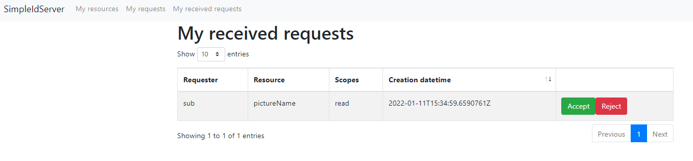

# Protect user's resource

> [!WARNING]
> In order to run the scenario, an OPENID and UMA server must be configured in a Visual Studio solution.
> The UMA2.0 server is relying on the OPENID server to authenticate end-users.

In this tutorial, we are going to protect the picture of a user.

## Source Code

The source code of this project can be found [here](https://github.com/simpleidserver/SimpleIdServer/tree/master/samples/UseUMAToProtectAPI).

## Configure OpenId server

The first step consists to configure the OPENID client.

* Open the Visual Studio solution and edit the `OpenIdDefaultConfiguration.cs` file.
* Register a `umaClient` client. This account is used by the UMA API to authenticate end-users.

```
new OpenIdClient
{
    ClientId = "umaClient",
    ClientSecret = "umaClientSecret",
    ApplicationKind = ApplicationKinds.Service,
    TokenEndPointAuthMethod = "client_secret_post",
    ApplicationType = "web",
    UpdateDateTime = DateTime.UtcNow,
    CreateDateTime = DateTime.UtcNow,
    TokenExpirationTimeInSeconds = 60 * 30,
    RefreshTokenExpirationTimeInSeconds = 60 * 30,
    TokenSignedResponseAlg = "RS256",
    IdTokenSignedResponseAlg = "RS256",
    AllowedScopes = new List<OAuthScope>
    {
        SIDOpenIdConstants.StandardScopes.OpenIdScope,
        SIDOpenIdConstants.StandardScopes.Profile,
        SIDOpenIdConstants.StandardScopes.Email
    },
    GrantTypes = new List<string>
    {
        "implicit",
        "authorization_code"
    },
    RedirectionUrls = new List<string>
    {
        "http://localhost:60003/signin-oidc"
    },
    PreferredTokenProfile = "Bearer",
    ResponseTypes = new List<string>
    {
        "token",
        "id_token",
        "code"
    }
}
```

* Register a `tradWebsite` client. This account will be used to get an access token valids on a specific user profile. This token will be transfered to the UMA service, it is used by internal authorization policies to check if incoming request have the permission to access to a specific resource.

```
new OpenIdClient
{
    ClientId = "tradWebsite",
    ClientSecret = "tradWebsiteSecret",
    ApplicationKind = ApplicationKinds.Web,
    TokenEndPointAuthMethod = "client_secret_post",
    ApplicationType = "web",
    UpdateDateTime = DateTime.UtcNow,
    CreateDateTime = DateTime.UtcNow,
    TokenExpirationTimeInSeconds = 60 * 30,
    RefreshTokenExpirationTimeInSeconds = 60 * 30,
    TokenSignedResponseAlg = "RS256",
    IdTokenSignedResponseAlg = "RS256",
    AllowedScopes = new List<OAuthScope>
    {
        SIDOpenIdConstants.StandardScopes.OpenIdScope,
        SIDOpenIdConstants.StandardScopes.Profile
    },
    GrantTypes = new List<string>
    {
        "authorization_code",
        "password"
    },
    RedirectionUrls = new List<string>
    {
        "https://localhost:5001/signin-oidc"
    },
    PreferredTokenProfile = "Bearer",
    ResponseTypes = new List<string>
    {
        "code",
        "token",
        "id_token"
    }
}
```

* Run the OPENID server.

```
cd src\OpenId
dotnet run --urls=https://localhost:5001
```

## Configure UMA server

The second step consists to configure the UMA server. A picture resource must be specified in order to protect it.

* Open the Visual Studio solution and edit the `UmaDefaultConfiguration.cs` file.
* Add a new picture resource. This resource belongs to the `sub` user.

```
new UMAResource("resourceId", DateTime.UtcNow)
{
    Translations = new List<UMAResourceTranslation>
    {
        new UMAResourceTranslation
        {
            Translation = new OAuthTranslation(Guid.NewGuid().ToString(), "pictureDescription", "en")
            {
                Type = "description"
            }
        },
        new UMAResourceTranslation
        {
            Translation = new OAuthTranslation(Guid.NewGuid().ToString(), "descriptionImage", "fr")
            {
                Type = "description"
            }
        },
        new UMAResourceTranslation
        {
            Translation = new OAuthTranslation(Guid.NewGuid().ToString(), "pictureName", "en")
            {
                Type = "name"
            }
        },
        new UMAResourceTranslation
        {
            Translation = new OAuthTranslation(Guid.NewGuid().ToString(), "nomImage", "fr")
            {
                Type = "name"
            }
        }
    },
    Scopes = new List<string>
    {
        "read"
    },
    Subject = "sub",
    Type = "type"
}
```

* Register an `api` client. This account is used by the REST.API service.

```
new OAuthClient
{
    ClientId = "api",
    ClientSecret = "apiSecret",
    TokenEndPointAuthMethod = "client_secret_post",
    UpdateDateTime = DateTime.UtcNow,
    CreateDateTime = DateTime.UtcNow,
    TokenExpirationTimeInSeconds = 60 * 30,
    RefreshTokenExpirationTimeInSeconds = 60 * 30,
    TokenSignedResponseAlg = "RS256",
    AllowedScopes = new List<OAuthScope>
    {
        UMAConstants.StandardUMAScopes.UmaProtection
    },
    GrantTypes = new List<string>
    {
        "client_credentials"
    },
    PreferredTokenProfile = "Bearer",
    ResponseTypes = new List<string>
    {
        "token"
    }
}
```

* Register a `client` client. An external client who is trying to access to the protected resource.

```
new OAuthClient
{
    ClientId = "client",
    ClientSecret = "clientSecret",
    TokenEndPointAuthMethod = "client_secret_post",
    UpdateDateTime = DateTime.UtcNow,
    CreateDateTime = DateTime.UtcNow,
    TokenExpirationTimeInSeconds = 60 * 30,
    RefreshTokenExpirationTimeInSeconds = 60 * 30,
    TokenSignedResponseAlg = "RS256",
    GrantTypes = new List<string>
    {
        "urn:ietf:params:oauth:grant-type:uma-ticket"
    },
    PreferredTokenProfile = "Bearer",
    ResponseTypes = new List<string>
    {
        "token"
    }
}
```

* Run the UMA server.

```
cd src\UmaHost
dotnet run --urls=http://localhost:60003
```

## Create API

The third step consists to create a REST.API service. 
It contains one operation used to get a picture by its identifier.

* Open a command prompt and navigate to the `src` subfolder of your project.
* Create a directory `WebApi` and create an ASP.NET CORE web API project in it :

```
mkdir WebApi

dotnet new webapi -n WebApi
```

* Add the `WebApi` project into your Visual Studio solution.

```
cd ..
dotnet sln add ./src/WebApi/WebApi.csproj
```

* Install the Nuget package `Microsoft.AspNetCore.Authentication.JwtBearer`. It will be used to add OAUTH2.0 authentication in the project.

```
dotnet add package Microsoft.AspNetCore.Authentication.JwtBearer
```

* Edit the `Startup.cs` file. Add the following code in the `ConfigureServices` procedure to configure the OAUTH2.0 authentication :

```
const string modulus = "3JsFC7E93xAShgnNp9dDWJPOHjJYLGPX464AfKW9gOB5CGD2uIYiP9m6yuZd73Z334RhQw616IMYijAvtpK25Nkk91KoAvrRoUGv2bl6pmX2JwUjwqe+lbmop4Rj9tzC2UBrGPcWSbIMNLaHkUrqR15DwVdFkG19QBwo9X6gOjCgSDvV0OY7vmwq1M3j2YmDwWnyTXh92wnUn2Hg57mVNZCX8RgdhdaWR6tiFP3QtgEYzZEulOGP6PKilqSr7E6Smg7mUNy6JTRkMGm1KZHTAY6HuNG5PPq0DUmsg8YMmsGEQPHMjw7IdaPxO0qy0aC1fiLj8NgWBOJ6bgrck55vfQ==";
const string exponent = "AQAB";
var rsa = RSA.Create();
var rsaParameters = new RSAParameters
{
    Modulus = Convert.FromBase64String(modulus),
    Exponent = Convert.FromBase64String(exponent)
};
rsa.ImportParameters(rsaParameters);
var issuerSigningKey = new RsaSecurityKey(rsa);
services.AddAuthentication(options =>
{
    options.DefaultChallengeScheme = JwtBearerDefaults.AuthenticationScheme;
})
    .AddJwtBearer(options =>
    {
        options.TokenValidationParameters = new TokenValidationParameters
        {
            IssuerSigningKey = issuerSigningKey,
            ValidAudiences = new List<string>
            {
                "client"
            },
            ValidIssuers = new List<string>
            {
                "http://localhost:60003"
            }
        };
    });
```

* Add a new `Picture` class.

```
public class Picture
{
    public string Id { get; set; }
    public string Description { get; set; }
    public string Name { get; set; }
    public string ResourceId { get; set; }
}
```

* Add a new controller `PicturesController`.
* Add a private function `GetAccessTokenWithUMAProtectionScope`. It will be called to get an access token valids on the `uma_protection` scope and use it to get a permission ticket valids on a specific UMA resource and scope.

```
private async Task<string> GetAccessTokenWithUMAProtectionScope()
{
    using (var httpClient = new HttpClient())
    {
        var request = new HttpRequestMessage
        {
            RequestUri = new Uri("http://localhost:60003/token"),
            Method = HttpMethod.Post,
            Content = new FormUrlEncodedContent(new Dictionary<string, string>
            {
                { "client_id", "api" },
                { "client_secret", "apiSecret" },
                { "grant_type", "client_credentials" },
                { "response_type", "token" },
                { "scope", "uma_protection" }
            })
        };

        var result = await httpClient.SendAsync(request);
        var json = await result.Content.ReadAsStringAsync();
        var jObj = JsonDocument.Parse(json);
        return jObj.RootElement.GetProperty("access_token").GetString();
    }
}
```

* Store one or more pictures in the `PicturesController` class.

```
private List<Picture> _pictures = new List<Picture>
{
    new Picture
    {
        Id = "id",
        Description = "description",
        Name = "name",
        ResourceId = "resourceId"
    }
};
```

* Add a new `Get` API operation. If the incoming request has the permission then the picture is returned.

```
[HttpGet("{id}")]
public async Task<IActionResult> Get(string id)
{
    var picture = _pictures.FirstOrDefault(p => p.Id == id);
    if (picture == null)
    {
        return new NotFoundResult();
    }

    var authResult = await _authenticationService.AuthenticateAsync(HttpContext, JwtBearerDefaults.AuthenticationScheme);
    var isAuthorized = authResult.Succeeded;
    if (isAuthorized)
    {
        isAuthorized = authResult.Principal.Claims.Any(c => {
            if (c.Type != "permissions")
            {
                return false;
            }


            var jObj = JsonDocument.Parse(c.Value);
            var resourceId = jObj.RootElement.GetProperty("resource_id").GetString();
            if (resourceId != picture.ResourceId)
            {
                return false;
            }

            return true;
        });
    }

    if (!isAuthorized)
    {
        using (var httpClient = new HttpClient())
        {
            var jObj = JsonSerializer.Serialize(new
            {
                resource_id = picture.ResourceId,
                resource_scopes = new string[] { "read" }
            });
            var accessToken = await GetAccessTokenWithUMAProtectionScope();
            var httpRequest = new HttpRequestMessage
            {
                RequestUri = new Uri("http://localhost:60003/perm"),
                Method = HttpMethod.Post,
                Content = new StringContent(jObj, Encoding.UTF8, "application/json")
            };
            httpRequest.Headers.Add("Authorization", $"Bearer {accessToken}");
            var httpResult = await httpClient.SendAsync(httpRequest);
            var json = await httpResult.Content.ReadAsStringAsync();
            return new BadRequestObjectResult(new
            {
                ticket = JsonDocument.Parse(json).RootElement.GetProperty("ticket").GetString()
            });

        }
    }

    return new OkObjectResult(picture);
}
```

* Run the REST.API.

```
cd src\UmaHost
dotnet run --urls=http://localhost:60004
```

## Access to the protected resource

Execute the [POSTMAN requests](https://documenter.getpostman.com/view/574127/UVXgMd2X#20586cf6-f530-4ece-8710-c9bb1221a3e3) in the correct order to access to the protected resource.
The collection contains the following requests :
1. If an empty HTTP request (with no Authorization header) is passed to the GET operation then a permission ticket (valids on a specific UMA resource and scope) will be returned.
2. An access token valids on a specific user profile is returned.
3. An access token valids on a specific protected resource and scope is returned.  Navigate to the [UMA website](http://localhost:60003), authenticate with the credentials - login : `sub`, password: `password`, click on `My received requests` and confirm the request.



4. The picture is returned because the access token has the permission to access to the protected resource.