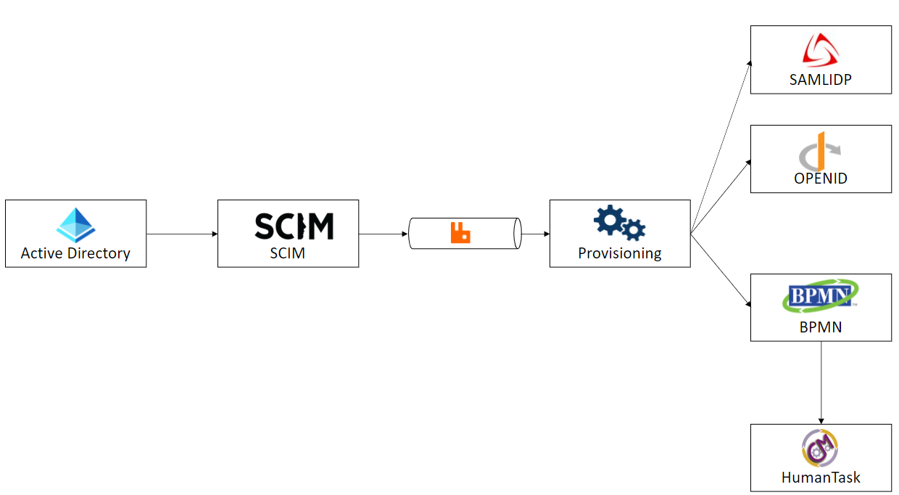
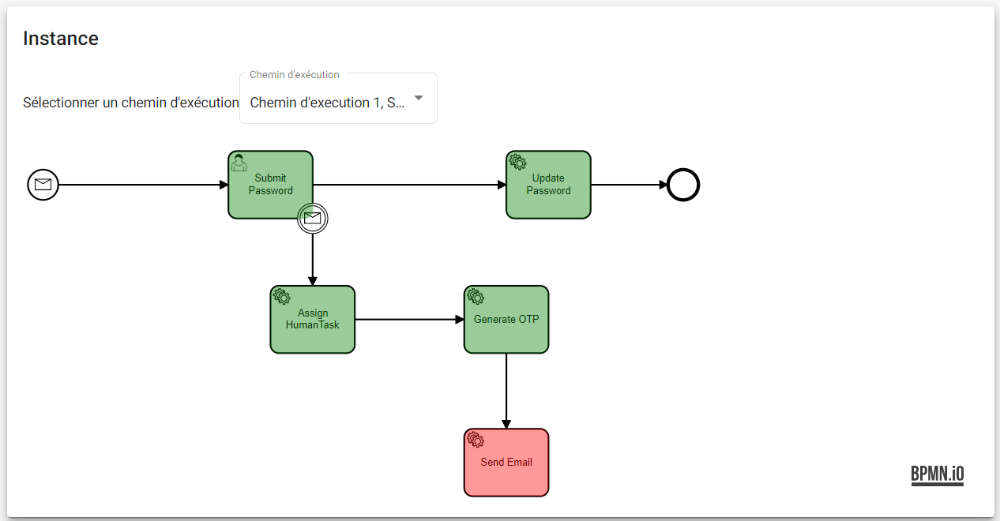

# Introduction

The provisioning lets you:

* **Automate Provisioning** : Automatically create new accounts in the right systems for new people when they join your team or organization. 
* **Automate Deprovisioning** : Automatically deactivate accounts in the right systems when people leave the team or organization.
* **Just In Time Provisioning** : Automatically create new accounts in the right systems for new people when they authenticate to an external identity provider.
* **Credential Provisioning** : Automatically ask to the users to submit their credentials. 

SCIM2.0 API is the entry point for users and groups management (for more details refer to this [part](../scim20/index.md)).
It is used by external clients for maintaining data consistency between multiple identity providers for example : between an active Directory and an OPENID Identity Provider. 

The workflow above describes the user provisioning / deprovisioning implementation made by SimpleIdServer. The credential provisioning is done by a BPMN workflow.  

1. A user arrives in the Active Directory.
2. An HTTP REQUEST is sent to the SCIM2.0 API in order to create, update or delete users. 
3. An external event is published to the message broker. 
4. The message is fetched and processed by the Provisioning windows service. 
5. Based on the nature of the message, the windows service executes a sequence of actions : Launch the BPMN workflow and send an HTTP request. The windows service can be configured via the administration portal. 
6. If the message received is “new user” then a BPMN workflow is launched, it will create and assign a human task to the end user. It will be used by the end user to update their credentials.
7. Execute an HTTP request in order to add, delete or update user from one identity provider.

# Getting started with Provisioning

This chapter explains how to automatically provision a user who is authenticating with an external identity provider. This scenario is called "Just In Time Provisioning". 

Before starting, ensure that SimpleIdServer is properly configured and installed on your machine:

1. Open the [administration portal](http://localhost:4200) and authenticate with an external identity provider (Facebook, SAMLIDP etc…). 

| Key      | Value    |
| -------- | -------- |
| Login    | sub      |
| Password | password |

2. Navigate to the “Tasks” page and open the first task. Update your password and click on confirm.  
3. Close your session and connect with an administrator account. 

| Key      | Value         |
| -------- | ------------- |
| Login    | administrator |
| Password | password      |

4. Navigate to the [Users](http://localhost:4200/users) page. Only one user is displayed, it corresponds to the user who authenticate with an external identity provider. Thanks to "Just In Time provisioning" mechanism, users who successfully authenticate with external identity providers automatically have local account. 

5. Navigate to the [Provisioning >> History](http://localhost:4200/provisioning/history) page. The history of user provisioning is displayed. 

6. Click on the link "Workflow".
7. The BPMN workflow is used to get password from the end-user. It generates a link, sends and email, create and assign a human task to the end user. By default there is one error in the workflow instance because the SMTP configuration is incorrect. 

# Configure Provisioning

The configuration of the provisioning windows service can be updated in the page [Provisioning >> Configuration](http://localhost:4200/provisioning/configurations). The following properties can be updated : 

| Property            | Description                                                                                                                                              |
| ------------------- | -------------------------------------------------------------------------------------------------------------------------------------------------------- |
| tokenEdp            | URL of the token endpoint. Used by the provisioning service in order to get an access token valid on the scope specified by the property “scopes”.       |
| clientId            | Client Identifier                                                                                                                                        |
| clientSecret        | Client Secret                                                                                                                                            |
| scopes              | List of scopes                                                                                                                                           |
| targetUrl           | URL where the JSON request will be sent                                                                                                                  |
| httpRequestTemplate | This template is used to generate the JSON request. It will be send to the "targetUrl".                                                                  |
| bpmnHost            | URL of the BPMN REST.API                                                                                                                                 |
| bpmnFileId          | Identifier of the BPMN file                                                                                                                              |
| messageToken        | This template is used to generate the JSON request. It will be sent to the "bpmnHost" in order to launch the BPMN workflow.                              |

# Configure BPMN workflow

The BPMN workflow is used to create and assign human tasks to the end-user in order to get the credential. Its definition is accessible in the page "Provisioning >> Workflows". 