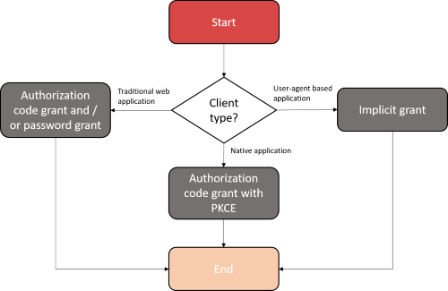
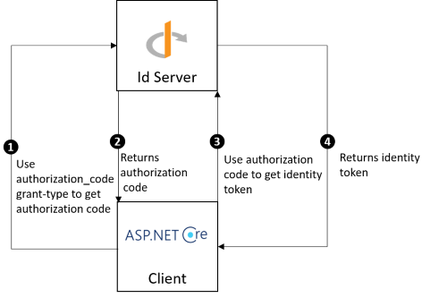

How to protect REST.API service from undesirable users ?
========================================================

There are different grant-types to get identity tokens, the choice depends on the type of client.

**Traditional websites** should use **authorization code** and / or **password** grant-type. If password grant-type is used, the client secret must be kept secret otherwise undesirable clients can use it and perform unexpected operations like issuing identity tokens.
In an ASP.NET CORE project it's better to store the client secret in backend side.
Examples of traditional websites :

============ =============
Frontend     Backend
------------ -------------
RAZOR pages  ASP.NET CORE
ANGULAR		 ASP.NET CORE
ANGULAR		 EXPRESS.JS
============ =============

**User-Agent based applications** should use the **implicit** grant-type, because all the application code is downloaded by the browser therefore the client secret cannot be stored by the application.
The implicit grant-type must be used by user-agent based applications. At the end of the process the identity token is returned to the application and there is not need to transfer the client secret.
Examples of user-agent based applications:

- Angular applications

- EmberJS applications

**Native applications** should use **authorization code with PKCE** grant-type because they are installed on the user's machine (mobile or computer), therefore any malicious users can try to fetch the client secret from the code source.
PKCE reduces security risks for native applications, as embedded secrets are not required in source code.

Technical implementation
------------------------

A sample project exists and can be downloaded `here`_, it shows how to use SimpleIdServer to protect a REST.API service from undesirable users.

The project contains 5 components :

1. OPENID server

2. Bank account REST.API

3. Traditional website (ASP.NET CORE)

4. Native application (Android)

5. User-agent based application (Angular)

To see the project in action :

1. Download the sample project and open the ``samples\\ProtectAPIFromUndesirableUsers\\ProtectAPIFromUndesirableUsers.sln`` solution with Visual Studio.

2. Open the file ``ProtectAPIFromUndesirableUsers.Native\\NativeConstants.cs`` and update the ``OPENID_BASE_URL`` with your IPV4 address. Localhost URL cannot be used by the Xamarin emulator.

3. Run all the projects, three console applications and one android emulator should be launched.

4. Open a command prompt and navigate to the project ``ProtectAPIFromUndesirableUsers.TraditionalWebsite``, execute the command `npm install` to restore the dependencies and execute `ng serve` to launch the application.

========================  ============================
URL			  			  Website
------------------------  ----------------------------
https://localhost:60000	  OPENID server
http://localhost:4200	  User-agent based application
https://localhost:5001	  Traditional website
https://localhost:6000	  Bank account REST.API
========================  ============================

Once everything is running you can start playing with the different applications. A user with the following credentials is configured by default :

========================  ============================
Property	  			  Value
------------------------  ----------------------------
login					  user
password				  password
========================  ============================

User-agent based application
----------------------------

As mentioned previously, user-agent based applications are using **implicit** grant-type to get identity tokens. The sample project contains a Single Page Application (SPA) developed with Angular, it is located at URL ``http://localhost:4200``.

.. image:: images/protect-api-undesirable-users-2.png
   :align: center

Traditional website
-------------------

Traditional website can use **password** and / or **authorization_code** grant-types. The sample project contains a traditional website developed with ASP.NET CORE, it is located at URL ``https://localhost:5001``.

Authorization code
******************

   
Password
********
   
.. image:: images/protect-api-undesirable-users-4.png
   :align: center

Native application
------------------

Native application can use **authorization_code** grant-type with PKCE authentication method. The sample project contains a native application developed with Xamarin.

.. image:: images/protect-api-undesirable-users-5.png
   :align: center

.. _here: https://github.com/simpleidserver/SimpleIdServer/tree/master/samples/ProtectAPIFromUndesirableUsers