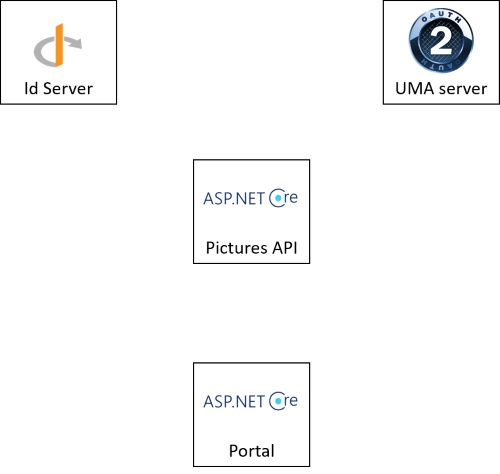
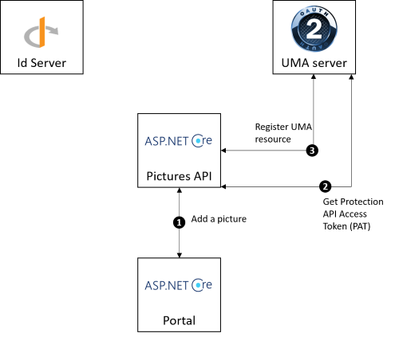
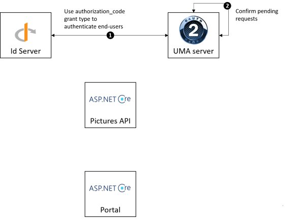

How to protect resources with UMA2.0 ?
======================================

The UMA 2.0 server offers to the end-user a way to manage access to his resources. 
For example, a user can decide who can access his pictures. Protected resources must be registered in the UMA2.0 server and their identifiers should be stored by the pictures API.

The **UseUMAToProtectAPI** sample project explains how to use UMA 2.0 to protect pictures, its code source can be downloaded `here`_.
The diagram below lists the components present in the project :

1. **Portal** : web portal where end-users can manage their pictures.

2. **Pictures API** : manage the lifecycle of pictures.

3. **IdServer** : OPENID implementation.

4. **UMA server** : UMA 2.0 implementation.

To see the project in action :

1. Download the sample project and open the **samples\\UseUMAToProtectAPI\\UseUMAToProtectAPI.sln** solution with Visual Studio.

2. Run all the projects, four console applications should be launched where each represents a different web application.

========================  ===========================
URL			 			  Website
------------------------  ---------------------------
https://localhost:5002	  Pictures REST.API service
https://localhost:60000	  OPENID
https://localhost:5001	  Portal
https://localhost:60001	  UMA
========================  ===========================

Once everything is running, you can start to authenticate to the application as a resource owner.

Authenticate as a resource owner
--------------------------------

Browse the website **https://localhost:5001**, click on the **Authenticate** button and authenticate with the following credentials :

===========  ===============
Property     Value
-----------  ---------------
Login    	 owner
Password	 password
===========  ===============

The web portal is configured to use **authorization_code** grant type to get identity tokens.

.. image:: images/use-uma-to-protect-api-2.png
   :align: center

Once end-users are authenticated they can start to add pictures.

Add pictures
------------

Browse the website **https://localhost:5001**, click on the **Add picture** button, fill in the form and click on **Add** to submit the form.
At the end a picture and a UMA resource are added. The workflow below describes the differents steps :

1. **Add a picture** : The web portal sends a HTTP POST request, the picture information are passed into the HTTP body and the identity token is passed into the **Authorization** header.

2. **Get Protection API Access Token (PAT)** : The REST.API service receives the request, verifies the signature of the identity token and uses the **client_credentials** grant-type to get an access token valids on the **uma_protection** scope.

3. **Register UMA resource** : The REST.API service sends a HTTP POST request, the UMA resource information are passed into the HTTP body like the scopes, name or description and the Protection API Access Token (PAT) is passed into the **Authorization header**. When the UMA resource is registered, its identifier is stored with the associated picture.

Now a picture has been registered by the resource owner. You can authenticate to the portal with an another account and try to access to the protected picture.

Trying to access to protected pictures
--------------------------------------

Browse the website **https://localhost:5001**, click on the **Authenticate** button and authenticate with the following credentials :

===========  ===============
Property     Value
-----------  ---------------
Login    	 requester
Password	 password
===========  ===============

Click on the **View pictures** button and click on the first element displayed under the **Other picture** title.
The message **request submitted** should be displayed. It indicates that a UMA request has been submitted, the resource owner must accept it to grant access to the picture.

.. image:: images/use-uma-to-protect-api-4.png
   :align: center

1. **Visit a picture without access token** : The web portal sends a HTTP GET request without authorization header.

2. **Get Protection API Token (PAT)** : The REST.API service receives the request and uses the **client_credentials** grant-type to get an access token valids on the **uma_protection** scope.

3. **Get permission ticket** : The UMA resource identifier is resolved based on the picture identifier. It is used by the API to request a permission ticket valids on certain scopes for example **read**. The PAT is needed to request a permission ticket and must be passed into the **Authorization** header. 

4. **Return ticket identifier** : Pictures REST.API service returns ticket identifier and UMA URL to the portal.

5. **Use urn:ietf:params:oauth:grant-type:uma-ticket grant-type to get access token** : Ticket identifier and identity token must be passed into the HTTP request.

6. **Visit a picture with access token** : The REST.API service receives the request, verifies the signature of the access token and verifies the permissions.

Now a request has been submitted, it should be validated by the resource owner.

Validate pending requests
-------------------------

Browse the website **https://localhost:5001**, click on the **Authenticate** button and authenticate with the following credentials :

===========  ===============
Property     Value
-----------  ---------------
Login    	 owner
Password	 password
===========  ===============

Click on the **Go to the UMA2.0 server** button, click on the **Authenticate** button and click on **My received requests**.
The web page lists the pending requests, they can be confirmed or rejected by the resource owner, but in the current context the pending requests should be confirmed.

1. **Use authorization_code grant type to authenticate end users**.

2. **Confirm pending requests** : Update authorization policies of the given UMA resources.

Now authorization policies have been updated, the second scenario can be re-executed. At the end the picture should be displayed.

.. _here: https://github.com/simpleidserver/SimpleIdServer/tree/master/samples/UseUMAToProtectAPI