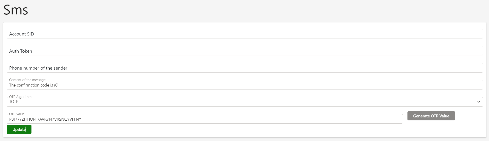

# Authentication methods

An [Authentication Method](../glossary) is of utmost importance as it ensures that the incoming user is indeed the person they claim to be

During the authentication process, the end-user presents their credentials to the [Identity Provider](../glossary). These credentials must be sufficiently complex and unique to the end-user, as any compromise could enable malicious use, allowing unauthorized access to another user's account.

Credentials can take various forms:
* A message signed by a cryptographic key owned by the end-user.
* A password.
* An OTP code generated by a mobile device.
* An OTP code sent by the Identity Server via email or SMS.

Each type of credential carries different security risks. For instance, using a password is riskier than using a cryptographic key. When configuring the manual identity provisioning workflow, it is essential to consider these security risks.

SimpleIdServer supports multiple authentication mechanisms.

| Code         | Name               | Description                                           |
| ------------ | ------------------ | ----------------------------------------------------- |
| **pwd**      | Password           | Login & Password                                      |
| **sms**      | SMS                | Send an OTP code via SMS                              |
| **email**    | Email              | Send an OTP code via email                            |
| **webauthn** | WebAuthn           | Utilize a FIDO-compliant device from your web browser |
| **mobile**   | Mobile application | Scan the QR code with the mobile application          |

## SMS

The SMS authentication module utilizes the [Twilio API](https://pages.twilio.com/) to send SMS messages to mobile devices.

Before you can use this module, you need to update its configuration.

To obtain the `Account SID`, `Auth Token`, and `Phone number of the sender` please refer to the [official documentation](https://www.twilio.com/docs/messaging/quickstart/csharp-dotnet-framework).

By default, the TOTP algorithm is used to generate OTP codes. TThe content of the SMS consists of a concatenation between the message content and the OTP code.

## Email

The Email authentication module uses an SMTP server to send emails.

The properties `Smtp Port`, `Smtp Host`, `Email`, `Password` and `Email of the sender` must be updated with the appropriate values.

