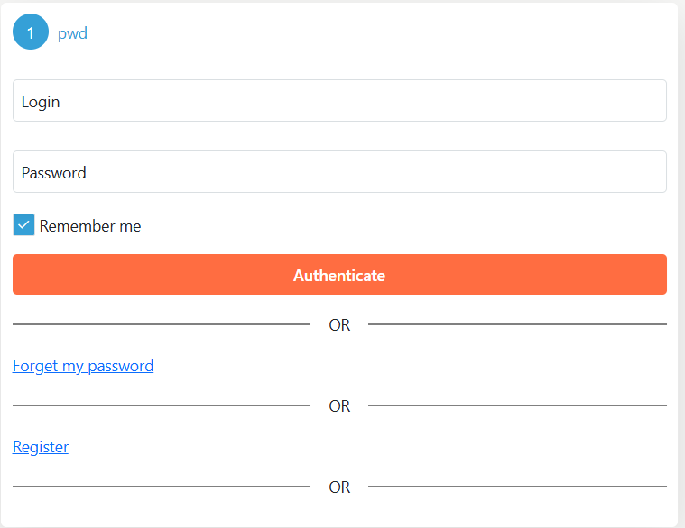
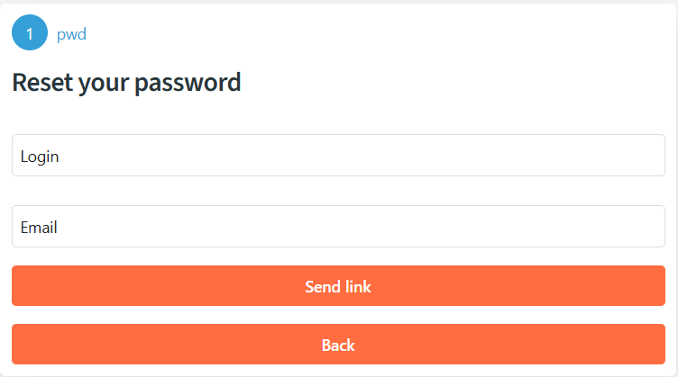
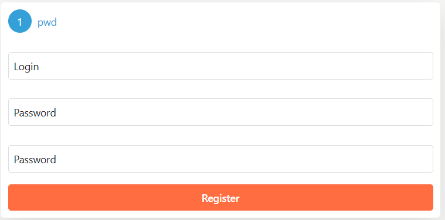

# Implementing an identity server with minimal UI

In this article, we’ll walk through the process of configuring a minimalist identity server with a graphical user interface (GUI) and a default login/password authentication method. This setup leverages the SimpleIdServer template, which provides a pre-built solution for identity management in ASP.NET Core. Whether you're a developer looking for a quick identity server setup or just experimenting, this guide will get you started.

## Step 1: Create the Solution

To begin, you can either manually download the code from the [SimpleIdServer repository](#) or use the following .NET CLI command to scaffold the solution directly from the SimpleIdServer template:

```batch title="cmd.exe"
dotnet new idserverui
````

This command generates a ready-to-use identity server project with a graphical interface and built-in authentication features.

### Project structure

Once the solution is created, you’ll notice the following directory structure:

* **Areas** : Contains subdirectories for each authentication method (e.g., OTP, mobile, WebAuthn). Each "area" includes the logic for authenticating or registering users.
* **Resources** : Holds translation files for localizing the web pages.
* **Views**: Stores the Razor views that make up the website’s UI.
* **wwwroot** : Contains static files like CSS and JavaScript for styling and functionality.
* **Program.cs**: The entry point of the application where the identity server is configured.

The solution references two key NuGet packages:

* **SimpleIdServer.IdServer**: Provides the core logic for turning an ASP.NET Core project into an identity server.
* **SimpleIdServer.IdServer.Pwd**: Adds support for login/password authentication.

By default, the template includes views and logic for various authentication methods (e.g., OTP, mobile, WebAuthn). If you don’t need these additional methods, you can safely delete the corresponding subdirectories under the `Areas` folder to streamline your project.

## Step 2 : Understanding the configuration

The heart of the configuration lies in the Program.cs file. Here’s an example of its default code:

```csharp  title="Program.cs"
var users = new List<User>
{
    UserBuilder.Create("administrator", "password", "Administrator")
        .SetFirstname("Administrator")
        .SetEmail("adm@mail.com")
        .Build()
};

var builder = WebApplication.CreateBuilder(args);
builder.AddSidIdentityServer()
    .AddDeveloperSigningCredential()
    .AddInMemoryUsers(users)
    .AddInMemoryLanguages(DefaultLanguages.All)
    .AddPwdAuthentication(true);

var app = builder.Build();
app.Services.SeedData();
app.UseSid();
app.Run();
```

Let’s break down what each part does:

1. **AddDeveloperSigningCredential**: Adds development certificates for signing tokens. In production, you’d replace this with proper certificates.
2. **AddInMemoryUsers**: Configures the in-memory user store with a predefined user (e.g., "administrator" with password "password").
3. **AddInMemoryLanguages**: Sets up language support for the UI, using all default languages provided by SimpleIdServer.
4. **AddPwdAuthentication(true)**: Enables login/password authentication and sets it as the default method.
5. **SeedData** : Initializes the application with default data, such as authentication workflows and UI settings.
6. **UseSid**: Configures the application’s routing for the identity server.

## Step 3 running the application

To launch the server, run the following command in the project directory:

```batch title="cmd.exe"
dotnet run
````
Once the application is running, open your browser and navigate to https://localhost:5001 (or the port specified in your configuration). You’ll see a login page like this:



Use the credentials `administrator` / `password` to log in.

### Built-in features

The default setup includes several useful features out of the box:

### 1. Password recovery

If you forget your password, click the "Forgot Password" link on the login page. You’ll see a form like this:



Note: By default, no notification method (e.g., email) is configured. In this case, set the email field to console. After clicking `Send link`, a reset link will appear in the console output. Copy this link into your browser to access the password reset page:


Here, you can update your password.

### 2. User registration

The solution also includes a basic registration form for creating new users:



Fill in the details to register a new user, who can then log in using the provided credentials.