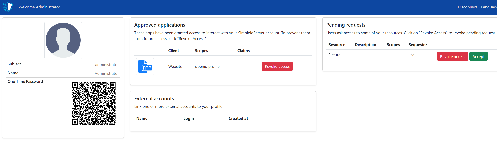

# Dotnet Template

Install SimpleIdServer templates.

```
dotnet new --install SimpleIdServer.Templates
```

This will add the following templates

| Command line                 | Description                                                                                      |
| ---------------------------- | ------------------------------------------------------------------------------------------------ |
| dotnet new idserver          | Create Identity Server. By default, Entity Framework is configured to use SQLServer              |
| dotnet new idserverwebsite   | Create Identity Server website. By default, Entity Framework is configured to use SQLServer      |
| dotnet new scim              | Create SCIM Server.                                                                              |
| dotnet new credissuer        | Create credential issuer API.                                                                    |
| dotnet new credissueradminui | Create credential issuer administration UI.                                                      |
| dotnet new fastfedappprov    | Create FastFed application provider                                                              |
| dotnet new fastfedidprov     | Create FastFed identity provider                                                                 |

## Create Visual Studio Solution

Open a command prompt and execute the following commands to create the directory structure for the solution.

```
mkdir Quickstart
cd Quickstart
mkdir src
dotnet new sln -n Quickstart
```

## Create IdentityServer project

To create a web project named `IdServer` with the `SimpleIdServer.IdServer` package installed, execute the command line :

```
cd src
dotnet new idserver -n IdServer
```

The following files will be created within a new `src/IdServer` directory :

* `IdServer.csproj` : Project file with the `SimpleIdServer.IdServer` NuGet package added.
* `appsettings.json` : Contains the ConnectionString.
* `Program.cs` : Main application entry point.
* `IdServerConfiguration.cs` : Contains the `Clients`, `Resources`.

Next, add the `IdServer` project into the Visual Studio Solution

```
cd ..
dotnet sln add ./src/IdServer/IdServer.csproj
```

Run the IdServer project, ensuring that it listens on the URL `https://localhost:5001`.

```
cd src/IdServer
dotnet run --urls=https://localhost:5001
```

The IdentityServer is now ready to be used. 

By default, there is one administrator account configured. You can access their profile by navigating to the URL `https://localhost:5001/master` and authenticate using the following credentials :

* Login : administrator
* Password : password

## IdentityServer UI preview

The IdentityServer UI uses Bootstrap 5.



## Create IdentityServer website project

create a web project named `IdServerWebsite` with the `SimpleIdServer.IdServer.Website` package installed, execute the command line :

```
cd src
dotnet new idserverwebsite -n IdServerWebsite
```

Run the `IdServerWebsite` project, it must listens on the url `https://localhost:5002/master/clients`.

```
cd src/IdServerWebsite
dotnet run --urls=https://localhost:5002
```

The IdentityServer website is now ready to be used.

The website can be used to manage all aspects of an Identity Server solution, such as managing clients, users, and scopes.

## Identity Server website UI preview

The IdentityServer website UI uses Radzen.


## SCIM Security

By default SCIM is configured to use API KEY authentication.
For clients to perform any operation, they must include one of those keys in the `HTTP HEADER Authorization Bearer` field.

| Owner    | Value                                |
| -------- | ------------------------------------ |
| IdServer | ba521b3b-02f7-4a37-b03c-58f713bf88e7 |
| AzureAd  | 1595a72a-2804-495d-8a8a-2c861e7a736a |

## Create SCIM project with EF support

Create a web project named `ScimEF` with the `SimpleIdServer.Scim.Persistence.EF` package installed and Entity Framework (EF) configured to use SQLServer, execute the command line :

```
cd src
dotnet new scim -n ScimEF --connectionString "Data Source=.;Initial Catalog=SCIM;Integrated Security=True;TrustServerCertificate=True" -t "SQLSERVER"
```

Next, add the `ScimEF` project into the Visual Studio Solution

```
cd ..
dotnet sln add ./src/ScimEF/ScimEF.csproj
```

Run the ScimEF project, ensuring that it listens on the URL `https://localhost:5003`.

```
cd src/SCIMEF
dotnet run --urls=https://localhost:5003
```

Now that the SCIM server is running, you can check its Schemas endpoint by accessing [https://localhost:5003/Schemas](https://localhost:5003/Schemas).

## Create SCIM project with MongoDB support

To create a web project named ScimMongoDB with the SimpleIdServer.Scim.Persistence.MongoDB package installed and MongoDB support, execute the command line :

```
cd src
dotnet new scim -n ScimMongoDB --connectionString "mongodb://localhost:27017" -t "MONGODB"
```

Next, add the `ScimMongoDB` project into the Visual Studio Solution

```
cd ..
dotnet sln add ./src/ScimMongoDB/ScimMongoDB.csproj
```

Run the ScimMongoDB project, ensuring that it listens on the URL `https://localhost:5003`.

```
cd src/ScimMongoDB
dotnet run --urls=https://localhost:5003
```

Now that the SCIM server is running, you can check its Schemas endpoint by accessing [https://localhost:5003/Schemas](https://localhost:5003/Schemas).

## Create credential issuer project

To create a web project named `CredentialIssuer` with the `SimpleIdServer.CredentialIssuer` package installed, execute the command line :

```
cd src
dotnet new credissuer -n CredentialIssuer
```

:::danger

If you are using version 5.0.0, you must install the NuGet package `Microsoft.IdentityModel.Protocols.OpenIdConnect` version `7.5.1`. Otherwise, the OpenIdConnect library will not be able to read the OpenID configuration from the well-known endpoint.

:::

The following files will be created within a new `src/CredentialIssuer` directory :

* `CredentialIssuer.csproj` : Project file with the `SimpleIdServer.CredentialIssuer` NuGet package added.
* `appsettings.json` : Contains the properties to configure the Openid authentication, such as the ClientId, ClientSecret and Issuer.
* `Program.cs` : Main application entry point.
* `CredentialIssuerConfiguration.cs` : Contains the `CredentialConfigurations`.

Run the CredentialIssuer project, ensuring that it listens on the URL `https://localhost:5005`.

```
cd src/IdServer
dotnet run --urls=https://localhost:5005
```

The CredentialIssuer is now ready to be used.

## Credential issuer UI preview

The CredentialIssuer UI uses Bootstrap 5.


## Create credential issuer website project

To create a web project named `CredentialIssuerAdminui` with the `SimpleIdServer.CredentialIssuer.Website` package installed, execute the command line :

```
cd src
dotnet new credissueradminui -n CredentialIssuerAdminui
```

:::danger

If you are using version 5.0.0, you must install the NuGet package `Microsoft.IdentityModel.Protocols.OpenIdConnect` version `7.5.1`. Otherwise, the OpenIdConnect library will not be able to read the OpenID configuration from the well-known endpoint.

:::

Run the `CredentialIssuerAdminui` project, it must listens on the url `https://localhost:5006`.

```
cd src/IdServerWebsite
dotnet run --urls=https://localhost:5006
```

The credential issuer administration ui is now ready to be used.

The website can be used to manage the credential configurations.

## Credential issuer website UI preview

The CredentialIssuer website UI uses Radzen.


## Create FastFed Application Provider

Create a web project named `FastFedApplicationProvider` with the `SimpleIdServer.FastFed.ApplicationProvider.Provisioning.Scim` package installed. To do this, run the following command:

```
cd src
dotnet new fastfedappprov -n FastFedApplicationProvider
```

## Create FastFed Identity Provider

Create a web project named `FastFedIdProvider` with the `SimpleIdServer.FastFed.ApplicationProvider.Provisioning.Scim` package installed and configured to use SQL Server as the message broker. Execute the following command:

```
cd src
dotnet new fastfedidprov -n FastFedIdProvider --messageBrokerConnectionString "Data Source=.;Initial Catalog=MessageBroker;Integrated Security=True;TrustServerCertificate=True" --messageBrokerTransport "SQLSERVER"
```