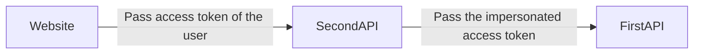

# Delegation or Impersonation

There are situations in which a REST API needs to act on behalf of users or other clients.

A subject can act on behalf of another subject in two ways: either through impersonation or delegation.

**Impersonation** occurs when the subject in a token is indistinguishable from the original one. The recipient of the token will typically be unaware that impersonation is taking place.

In case of a **Delegation** , a token contains explicit information that one subject delegates its rights to another entity. The call chain is preserved using the `act` claim.

In this tutorial, we will implement the following delegation scenario. The `SecondAPI` REST API acts on behalf of the end-user.



1. The website calls a REST API to retrieve the list of shops.
2. The REST API uses the `urn:ietf:params:oauth:grant-type:token-exchange` grant type to receive an access token valid on the `shopApiOther` scope and acts on behalf of the authenticated user. This access token is used to access the second REST API.
3. The REST API receives the access token and checks its audience.

## 1. Define the first permission

1. Open the Identity Server website at [https://localhost:5002](https://localhost:5002).
2. Open the Scopes screen and click on the `Add scope` button.
3. Select `API value` and click on next.
4. Fill-in the form like this and click on the `Save` button to confirm the creation.

| Parameter   | Value   |
| ----------- | ------- |
| Name        | shopApi |
| Description | shopApi |

5. Navigate to the new scope, then select the `API Resources` tab and click on the `Add API resource` button.
6. Fill-in the form like this and click on the `Add` button to confirm the creation.

| Parameter   | Value   |
| ----------- | ------- |
| Name        | shopApi |
| Audience    | shopApi |
| Description | shopApi |

## 2. Define the second permission

1. Open the Identity Server website at [https://localhost:5002](https://localhost:5002).
2. Open the Scopes screen, click on the `Add scope` button.
3. Select `API value` and click on next.
4. Fill-in the form like this and click on the `Save` button to confirm the creation.

| Parameter   | Value        |
| ----------- | ------------ |
| Name        | shopApiOther |
| Description | shopApiOther |

5. Navigate to the new scope, then select the `API Resources` tab and click on the `Add API resource` button.
6. Fill-in the form like this and click on the `Add` button to confirm the creation.

| Parameter   | Value        |
| ----------- | ------------ |
| Name        | shopApiOther |
| Audience    | shopApiOther |
| Description | shopApiOther |

## 3. Configure the website

1. Open the Identity Server website at [https://localhost:5002](https://localhost:5002).
2. On the Client screen, click on the `Add client button`.
3. Select `web application` and click on next.
4. Fill-in the form like this and click on the `Save` button to confirm the creation.

| Parameter        | Value                             |
| ---------------- | --------------------------------- |
| Identifier       | delegationWebsite                 |
| Secret           | password                          |
| Name             | delegationWebsite                 |
| Redirection URLS | http://localhost:5004/signin-oidc |

5. Click on the new client, then select the `Client scopes` tab and click on `Add client scope` button. Choose the `shopApi` scope and click on the `Save` button.

## 4. Configure the API

1. Open the Identity Server website at [https://localhost:5002](https://localhost:5002).
2. On the Client screen, click on the `Add client button`.
3. Select `machine` and click on next.
4. Fill-in the form like this and click on the `Save` button to confirm the creation.

| Parameter        | Value                             |
| ---------------- | --------------------------------- |
| Identifier       | firstDelegationApi                |
| Secret           | password                          |
| Name             | firstDelegationApi                |

5. Click on the new client, in the `Details` tab, select the `Token exchange` grant-type, set the token exchange type to `Delegation` and click on the `Save` button.
6. Select the `Client scopes` tab and click on `Add client scope` button. Choose the `shopApiOther` scope and click on the `Save` button.

## 5. Create the first API

Create and configure the first REST.API service

1. Open a command prompt and execute the following commands to create the directory structure for the solution.

```
mkdir Delegation
cd Delegation
mkdir src
dotnet new sln -n Delegation
```

2. Create a REST.API project named `ShopApiOther` and install the `Microsoft.AspNetCore.Authentication.JwtBearer` Nuget package.

```
cd src
dotnet new webapi -n ShopApiOther
cd ShopApiOther
dotnet add package Microsoft.AspNetCore.Authentication.JwtBearer
```

3. Add the `ShopApiOther` project into your Visual Studio solution.

```
cd ..\..
dotnet sln add ./src/ShopApiOther/ShopApiOther.csproj
```

4. Edit the file `ShopApiOther\Program.cs` and configure the JWT authentication. Additionally, add an Authorization policy named `Shops` that checks if the access token has the correct audience.

```
builder.Services.AddAuthentication(options =>
{
    options.DefaultAuthenticateScheme = JwtBearerDefaults.AuthenticationScheme;
}).AddJwtBearer(options =>
{
    options.Authority = "https://localhost:5001/master";
    options.RequireHttpsMetadata = false;
    options.TokenValidationParameters = new TokenValidationParameters
    {
        ValidAudiences = new List<string>
        {
            "shopApiOther"
        },
        ValidIssuers = new List<string>
        {
            "https://localhost:5001/master"
        }
    };
});
builder.Services.AddAuthorization(options =>
{
    options.AddPolicy("Shops", p => p.RequireAuthenticatedUser());
});
```

5. Add a `ShopsController` controller with one protected operation.

```
[ApiController]
[Route("shops")]
public class ShopsController : ControllerBase
{
    [HttpGet]
    [Authorize("Shops")]
    public IActionResult Get()
    {
        return new OkObjectResult(new[] { "shop1", "shop2" });
    }
}
```

6. In a command prompt, navigate to the `src\ShopApiOther` directory and launch the application.

```
dotnet run --urls=http://localhost:5006
```

## 6. Create the second API

Create and configure the second REST.API service

1. Create a REST.API project named `ShopApi` and install the `Microsoft.AspNetCore.Authentication.JwtBearer` Nuget package.

```
cd src
dotnet new webapi -n ShopApi
cd ShopApi
dotnet add package Microsoft.AspNetCore.Authentication.JwtBearer
```

3. Add the `ShopApi` project into your Visual Studio solution.

```
cd ..\..
dotnet sln add ./src/ShopApi/ShopApi.csproj
```

4. Edit the file `ShopApi\Program.cs` and configure the JWT authentication. Additionally, add an Authorization policy named `Shops` that checks if the access token has the correct audience.

```
builder.Services.AddAuthentication(options =>
{
    options.DefaultAuthenticateScheme = JwtBearerDefaults.AuthenticationScheme;
}).AddJwtBearer(options =>
{
    options.Authority = "https://localhost:5001/master";
    options.RequireHttpsMetadata = false;
    options.TokenValidationParameters = new TokenValidationParameters
    {
        ValidAudiences = new List<string>
        {
            "shopApi"
        },
        ValidIssuers = new List<string>
        {
            "https://localhost:5001/master"
        }
    };
});
builder.Services.AddAuthorization(options =>
{
    options.AddPolicy("Shops", p => p.RequireAuthenticatedUser());
});
```

5. Add a `ShopsController` controller with one protected operation. It uses the `urn:ietf:params:oauth:grant-type:token-exchange` grant type to obtain an access token valid for the `shopApiOther` scope and utilizes it to make a call to the first REST API service.

```
[ApiController]
[Route("shops")]
public class ShopsController : ControllerBase
{
    [HttpGet]
    [Authorize("Shops")]
    public async Task<IActionResult> Get()
    {
        const string url = "http://localhost:5006/shops";
        var accessToken = await GetAccessToken();
        using (var httpClient = new HttpClient())
        {
            var requestMessage = new HttpRequestMessage(HttpMethod.Get, url);
            requestMessage.Headers.Add("Authorization", $"Bearer {accessToken}");
            var httpResult = await httpClient.SendAsync(requestMessage);
            var json = await httpResult.Content.ReadAsStringAsync();
            var shopNames = JsonSerializer.Deserialize<string[]>(json);
            return new OkObjectResult(shopNames);
        }
    }

    private async Task<string> GetAccessToken()
    {
        const string clientId = "firstDelegationAPi";
        const string clientSecret = "password";
        const string tokenUrl = "https://localhost:5001/master/token";
        var subjectToken = Request.Headers["Authorization"].ElementAt(0).Split(" ")[1];
        using (var httpClient = new HttpClient())
        {
            var dic = new List<KeyValuePair<string, string>>
            {
                new KeyValuePair<string, string>("grant_type", "urn:ietf:params:oauth:grant-type:token-exchange"),
                new KeyValuePair<string, string>("client_id", clientId),
                new KeyValuePair<string, string>("client_secret", clientSecret),
                new KeyValuePair<string, string>("subject_token", subjectToken),
                new KeyValuePair<string, string>("subject_token_type", "urn:ietf:params:oauth:token-type:access_token"),
                new KeyValuePair<string, string>("scope", "shopApiOther")
            };
            var requestMessage = new HttpRequestMessage
            {
                Method = HttpMethod.Post,
                Content = new FormUrlEncodedContent(dic),
                RequestUri = new Uri(tokenUrl)
            };
            var httpResult = await httpClient.SendAsync(requestMessage);
            var json = await httpResult.Content.ReadAsStringAsync();
            var accessToken = (JsonObject.Parse(json) as JsonObject).First(k => k.Key == "access_token").Value.ToString();
            return accessToken;
        }
    }
}
```

The access contains the following claims :

| Claim     | Description                       | Value                   |
| --------- | --------------------------------- | ----------------------- |
| sub       | subject of the authenticated user | administrator           |
| act       | Contains the chain of delegation  | {act : sub : shopApi }` |
| scope     | List of scopes                    | shopApiOther            |
| aud       | Audience                          | shopApiOther            |
| client_id | Client identifier                 | delegationWebsite       |

6. In a command prompt, navigate to the `src\ShopApi` directory and launch the application.

```
dotnet run --urls=http://localhost:5005
```

## 7. Create the website

Create and configure an ASP.NET CORE application

1. Create a web project named `Website` and install the Microsoft.AspNetCore.Authentication.OpenIdConnect NuGet package.

```
cd src
dotnet new mvc -n Website
cd Website
dotnet add package Microsoft.AspNetCore.Authentication.OpenIdConnect
```

2. Add the `Website` project into your Visual Studio solution.

```
cd ..\..
dotnet sln add ./src/Website/Website.csproj
```

3. Edit the `Program.cs` file and configure the OpenID authentication.

```
builder.Services.AddAuthentication(options =>
{
    options.DefaultScheme = "Cookies";
    options.DefaultChallengeScheme = "sid";
})
    .AddCookie("Cookies")
    .AddOpenIdConnect("sid", options =>
    {
        options.SignInScheme = "Cookies";
        options.ResponseType = "code";
        options.Authority = "https://localhost:5001/master";
        options.RequireHttpsMetadata = false;
        options.ClientId = "delegationWebsite";
        options.ClientSecret = "password";
        options.GetClaimsFromUserInfoEndpoint = true;
        options.SaveTokens = true;
        options.Scope.Add("shopApi");
    });
...
app.UseCookiePolicy(new CookiePolicyOptions
{
    Secure = CookieSecurePolicy.Always
});
app.UseHttpsRedirection();
app.UseStaticFiles();
app.UseRouting();
app.UseAuthorization();
```

4. Add a `ShopsController` controller with one protected operation.

```
public class ShopsController : Controller
{
    [Authorize]
    public async Task<IActionResult> Index()
    {
        var accessToken = await HttpContext.GetTokenAsync("access_token");
        const string url = "http://localhost:5005/shops";
        using(var httpClient = new HttpClient())
        {
            var requestMessage = new HttpRequestMessage(HttpMethod.Get, url);
            requestMessage.Headers.Add("Authorization", $"Bearer {accessToken}");
            var httpResult = await httpClient.SendAsync(requestMessage);
            var json = await httpResult.Content.ReadAsStringAsync();
            var shopNames = JsonSerializer.Deserialize<string[]>(json);
            return View(new ShopsViewModel { Shops = shopNames });
        }
    }
}
```

5. Create a view `Views\Shops\Index.cshtml`with the following content. This view will display the names of the Shop.
6. In a command prompt, navigate to the `src\Website` directory and launch the application.

```
dotnet run --urls=http://localhost:5004
```

Finally, browse the following URL: [http://localhost:5004/shops]([http://localhost:5004/shops). The User-Agent will be automatically redirected to the OpenID server. Submit the following credentials and confirm the consent. You will be redirected to the screen where the shops will be displayed.

| Credential | Value         |
| ---------- | ------------- |
| Login      | administrator |
| Password   | password      |