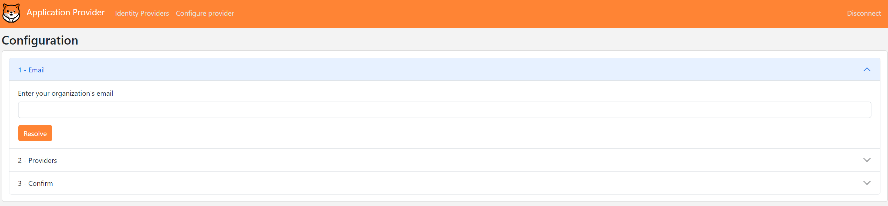
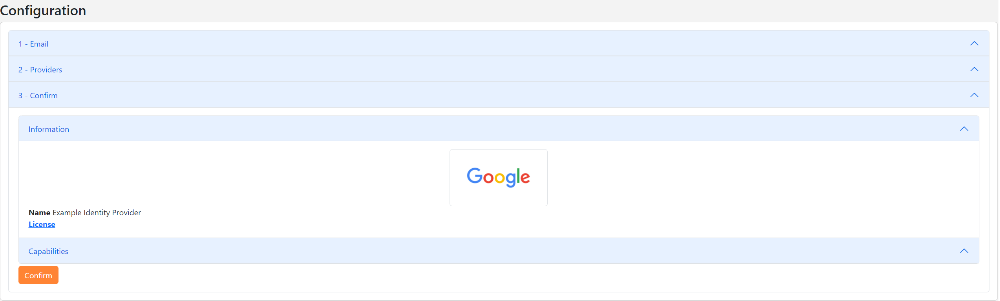

# Openid FastFed 

The purpose of the OpenID FastFed standard is to simplify the administrative effort required to configure identity federation between a company's identity provider and a hosted application or application provider.

Let’s consider an example: imagine a user working for an employer called "Company.com." The user discovers a tool at "onlineservice.com" that helps them be more productive. To use the tool, the user creates a local account using their work email address, "user@company.com."

It is possible to use the work email address for authentication if a federation exists between the company’s identity provider and the application. However, configuring this federation can be time-consuming and complex, as it involves manual steps such as:
* Creating an OpenID client in the company's identity server.
* Updating and configuring the "onlineservice.com" website to use the newly created OpenID client.
* And more...

The OpenID FastFed standard simplifies this process, making it easier to establish federation between a hosted application and an identity provider. Once the federation is set up, the application can authenticate employees using Single Sign-On (SSO) via the company's Identity Server. Additionally, the application can receive user information from the company using provisioning protocols like SCIM.

:::warning

Currently, the SimpleIdServer project only supports identity provisioning via SCIM. Authentication protocols such as SAML are supported but not yet documented

:::

## SCIM Provisioning Workflow

In this tutorial, we will use the OpenID FastFed standard to establish identity provisioning via SCIM between the application provider and the identity server.

The workflow consists of the following steps, though it may vary depending on your use case:

1. A worker visits the application provider (https://application.com) and enters their work email address (user@company.com) to create a local account.

2. The application provider uses the email address to retrieve the webfinger of the company (https://company.com/.well-known/webfinger) and displays the list of OpenID FastFed endpoints.

3. The worker selects the FastFed endpoint and submits their choice.

4. The application provider fetches the capabilities of the selected endpoint (https://company.com/fastfed/provider-metadata) and displays them.

5. The worker reviews the capabilities and confirms their choice.

6. The worker is redirected to the registration endpoint of the company’s identity provider.

7. The identity provider fetches the capabilities of the application provider (https://application.com/fastfed/provider-metadata) and displays them.

8. The user clicks "Confirm" to complete the registration.

9. The identity provider sends the registration result to the application provider.

10. Finally, the application provider creates an OAuth client, which will be used by the identity provider to interact with the SCIM endpoint of the application.

Once SCIM identity provisioning is established between the application provider and the identity server, the SCIM endpoint of the application will receive user information from the company.

In the following chapters, we will implement this architecture.

## Identity Server

The identity server must be up and running. If you don't have one configured, you can use the [DOTNET Template](../installation/dotnettemplate#create-identityserver-project) to create the project.

The message broker must be configured to use SQL Server as the transport.
Open the `appsettings.json` file and ensure that `MessageBrokerOptions.Transport` is set to `SQLSERVER` and that the `MessageBrokerOptions.ConnectString` is correctly set.

```
  ...
  "MessageBrokerOptions": {
    "Transport": "SQLSERVER",
    "ConnectionString": "Data Source=.;Initial Catalog=MessageBroker;Integrated Security=True;TrustServerCertificate=True",
    "Username": "username",
    "Password": "password"
  },
  ...
```

For this tutorial, we assume that the Identity Server is listening on port 5001.

```
dotnet run --urls=https://localhost:5001
```

## Administration Website

The administration website must also be up and running. If you don't have one configured, you can use the [DOTNET Template](../installation/dotnettemplate#create-identityserver-website-project) to create the project. This website will be used by the administrator to add users.

For this tutorial, we assume that the Administration website is listening on port 5002.

```
dotnet run --urls=https://localhost:5002
```

## SCIM2.0 server

The SCIM 2.0 server must be up and running. If you don't have one configured, you can use the [DOTNET Template](../installation/dotnettemplate#create-scim-project-with-ef-support).
Once federation is established between the application and the identity provider, the SCIM 2.0 server will receive requests from the identity provider.

For this tutorial, we assume that the SCIM server is listening on port 5003.

```
dotnet run --urls=https://localhost:5003
```

## Fastfed application provider

Follow these steps to create and configure the FastFed application provider:

1. Open a command prompt and execute the following commands to create the directory structure for the solution:

```
mkdir FastFed
cd FastFed
mkdir src
dotnet new sln -n FastFed
```

2. Create a web project named `FastFedApplicationProvider` with OpenID FastFed configured:

```
cd src
dotnet new fastfedappprov -n FastFedApplicationProvider
```

3. Add the `FastFedApplicationProvider` project into your Visual Studio solution.

```
cd ..
dotnet sln add ./src/FastFedApplicationProvider/FastFedApplicationProvider.csproj
```

Now that your web application is configured, you can launch it on port 5021:

```
dotnet run --urls=https://localhost:5021
```

## FastFed Identity Provider

Follow these steps to create and configure the FastFed identity provider:

1. Create a web project named `FastFedIdProvider` with OpenID FastFed configured. The message broker will be set up to use SQL Server as the transport. Ensure that the `MessageBrokerOptions.ConnectionString`  is the same as the one configured in the Identity Server.

```
dotnet new fastfedidprov -n FastFedIdProvider --messageBrokerConnectionString "Data Source=.;Initial Catalog=MessageBroker;Integrated Security=True;TrustServerCertificate=True" --messageBrokerTransport "SQLSERVER"
```

2. Add the `FastFedIdProvider` project into your Visual Studio solution.

```
cd ..
dotnet sln add ./src/FastFedIdProvider/FastFedIdProvider.csproj
```

Now that your web application is configured, you can launch it on port 5020:

```
dotnet run --urls=https://localhost:5020
```

## Enable SCIM provisioning

Now that all the applications are running on your local machine, you can enable SCIM provisioning between the application provider and the identity provider.

1. Navigate to the application provider at [https://localhost:5021](https://localhost:5021) and click on the `Authenticate` button.

2. Log in with the following credentials:

| Parameter | Value         |
| --------- | ------------- |
| Login     | administrator |
| Password  | password      |

3. After logging in, click on the `Configure provider` button.



4. Enter the work email address `jane@localhost:5020` and click on the `Resolve` button.

5. Select the `https://localhost:5020/fastfed` provider and click on the `Choose` button.


6. The application provider's capabilities will be displayed. Click on the `Confirm` button.



7. You will be redirected to the identity provider for your company (localhost:5020). Click on the `Confirm` button to finalize the establishment of SCIM provisioning.


8. On the next screen, configure the security for the SCIM client. Enter the following details and click on the`Update` button.

| Parameter | Value | 
| --------- | ----- |
| Authentication type | Api Key |
| Api Secret | ba521b3b-02f7-4a37-b03c-58f713bf88e7 |

## Enroll a User

Now that SCIM provisioning is enabled, you can add a user and verify if they have been correctly enrolled via the SCIM API.

1. Navigate to the administration website [https://localhost:5002/master/users](https://localhost:5002/master/users) and click on the `Add user` button.

2. Fill in the fields with random information and click the `Add` button.

3. Navigate to the identity provider website [https://localhost:5020](https://localhost:5020) and click on the `Application Providers` menu item.

4. Open the first entity and check if the number of records migrated using the `urn:ietf:params:fastfed:1.0:provisioning:scim:2.0:enterprise` provisioning profile has increased.

