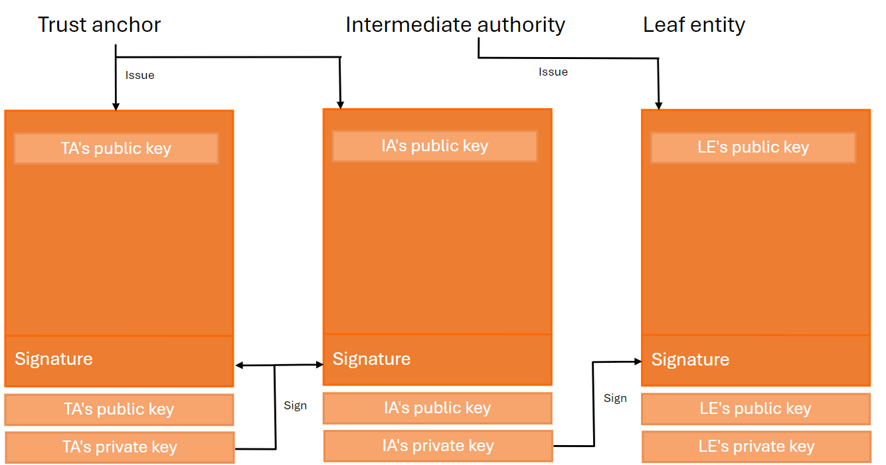

# Openid Federation

The OpenID Federation specification was officially published by the OpenID Connect Working Group on May 31, 2024.

The objective of this new specification is to establish a trust relationship between the OpenID server and the relying parties. 
Therefore, the manual provisioning of the relying parties via a web portal or a dedicated REST API will no longer be needed.

There are several advantages to using OpenID Federation:

* Less human administration.
* Relying parties can manage their properties, such as the redirect_uri.
* Easily establish a trust relationship between the OpenID server and the relying party.

The OpenID Federation is already required by other technologies, such as the issuance of [Verifiable Credentials](https://openid.github.io/OpenID4VP/openid-4-verifiable-presentations-wg-draft.html#section-11.2).
In this context, the OpenID Federation is used to establish a trust relationship between an electronic wallet/verifier and a credential issuer.
Suppose both applications adhere to a known trust scheme, for example, `BSc chemistry degree`.
In that case, the electronic wallet will be able to call its federation API to determine if the credential issuer is indeed a member of the federation/trust scheme that it claims to be.

For more information about the interactions between the electronic wallet and the credential issuer, you can refer to the [official documentation](https://openid.github.io/OpenID4VP/openid-4-verifiable-presentations-wg-draft.html).

This specification takes all its concepts from the Public Key Infrastructure (PKI), but there are some differences between the two:

* The Public Key Infrastructure uses certificates, and the Certificate Authority is installed in the Trusted Root Certificate Authorities certificate store. It contains the root certificates of all CAs that Windows trusts.

* The OpenID Federation uses Entity Statements. Each entity involved in the trust chain has a REST API that exposes some operations described in the [specification](https://openid.net/specs/openid-federation-1_0.html).

Before proceeding further, we will explain the Public Key Infrastructure.

## Chain of trust in Public Key Infrastructure (PKI)

The purpose of a PKI is to facilitate the secure electronic transfer of information for a range of network activities such as e-commerce, internet banking, and confidential email.

PKI uses cryptographic public keys that are connected to a digital certificate, which authenticates the device or user sending the digital communication. Digital certificates are issued by a trusted source, a certificate authority (CA), and act as a type of digital passport to ensure that the sender is who they say they are.

The client who receives a digital certificate, for example, a browser visiting a secure website, validates if the issuer of this certificate exists in its list of trusted root certificates. If there is no match, the client tries to resolve the chain of trust by finding the trusted root certificate authority that has signed the issuing CA certificate.

The chain of trust is an important concept because it proves that the certificate comes from a trusted source. The usage of a certificate store is sufficient to resolve a chain of trust.

There are three basic types of entities that comprise a valid chain of trust:

* **Root CA certificate** : The Root CA certificate is a self-signed X.509 certificate. This certificate acts as a trust anchor, used by all the relying parties as the starting point for path validation. The Root CA private key is used to sign the Intermediate CA certificates.

* **Intermediate CA certificate** : The Intermediate CA certificate sits between the Root CA certificate and the end entity certificate. The Intermediate CA certificate signs the end entity certificates.

* **End-Entity certificate** : The End-Entity certificate is the server certificate that is issued to the website domain.


This chain of trust is also present in the OpenID Federation specification.

## Chain of trust in OPENID federation

The chain of trust in the OpenID Federation is made up of more than two Entity Statements.

An Entity Statement is a signed JSON Web Token (JWT). The subject of the JWT is the entity itself. The issuer of the JWT is the party that issued the Entity Statement. All entities in a federation publish an Entity Statement about themselves called an Entity Configuration.

Entities whose statements build a trust chain are categorized as:

* **Trust anchor** : An entity that represents a trusted third party.

* **Leaf** : In an OpenID Connect identity federation, a relying party or a protected resource.

* **Intermediate** : Neither a leaf entity nor a trust anchor.



The resolution of the trust chain is more complex than that present in the Public Key Infrastructure.

Consider the following entities:

* **Relying party** : http://localhost:7001

* **Trust anchor** : http://localhost:7000

The algorithm used to fetch the trust chain consists of the following actions:

1. Retrieve the entity configuration from the endpoint `http://localhost:7001/.well-known/openid-federation`.

2. Store the JSON Web Token into the trust chain.

3. Parse the JSON Web Token and retrieve the list of `authority_hints` from the payload.

4. For each record in the `authority_hints`, execute the following actions :

   4.1. Retrieve the entity configuration from the `authority_hint` (`<authority_hint>/.well-known/openid-federation`).

   4.2. Parse the JSON Web Token and extract the `federation_fetch_endpoint`.

   4.3. Fetch the entity configuration of the relying party `http://localhost:7001` (`<authority_hint>/<federation_fetch_endpoint>?sub=http://localhost:7000`) and store the result into the trust chain.

5. The last entity configuration coming from the `/.well-known/openid-federation` is the trust anchor and must be stored into the trust chain.

In the end, the trust chain must contain three records.

## Difference between PKI and OPENID federation

The structure of the trust chain between both technologies is similar and consists of the same components. 
The difference lies in the terminology of the entities used and their nature. 
In PKI, an entity is a certificate; however, in OpenID Federation, an entity is represented as an Entity Statement.

| PKI                         | Openid federation |
| --------------------------- | ----------------- |
| Root CA certificate         | Trust anchor      |
| Intermediate CA certificate | Intermediate      |
| End-entity certificate      | Leaf              |

The trust chain algorithm proposed by OpenID Federation is more complex than the one used by PKI. 
In OpenID Federation, a set of HTTP requests is executed to retrieve a list of Entity Statements, whereas in PKI, only the certificate store is used.

Now that you understand the differences between PKI and OpenID Federation, we will explain how a relying party can register itself against an OpenID Identity Server.

## Client registration

There are two approaches to establish trust between a relying party and an identity provider: automatic registration and explicit registration.

### Automatic registration

Automatic registration enables a relying party to make authentication requests without a prior registration step with the identity provider. Once the authorization request is received by the identity provider, it will use the client identifier to resolve the chain of trust and check its validity. For more information about this type of registration, refer to the [documentation](https://openid.net/specs/openid-federation-1_0.html#section-12.1).
If the chain of trust is valid, then the client will be registered.

### Explicit registration

The relying party establishes its client registration with the identity provider by means of a dedicated registration request, similar to the [Openid Registration](https://openid.net/specs/openid-connect-registration-1_0.html). However, instead of its metadata, the relying party submits its Entity Configuration or an entire trust chain. When the explicit registration is completed, the relying party can proceed to make regular OpenID authentication requests to the identity provider.

The expiration time of the client corresponds to the minimum of the expiration time of the trust chain. 
When the client expires, the identity provider tries to refresh the trust chain and update the metadata of the client accordingly.

In the next chapter, we will describe how to implement the OpenID Federation with .NET Core.

## Demo

In this demo, we will create a solution with three projects.

| Project           | Url                    |
| ----------------- | ---------------------- |
| Relying Party     | http://localhost:7001  |
| Trust anchor      | http://localhost:7000  |
| Identity Provider | https://localhost:5001 |

### 1. Create the trust anchor project

Create and configure the trust anchor project.

1. Open a command prompt and execute the following commands to create the directory structure for the solution.

```
mkdir OpenidFederation
cd OpenidFederation
mkdir src
dotnet new sln -n OpenidFederation
```

2. Create a REST.API project named `TaApi` and install the Nuget packages `SimpleIdServer.Authority.Federation` and `SimpleIdServer.OpenidFederation.Store.EF`.

```
cd src
dotnet new webapi -n TaApi
cd TaApi
dotnet add package SimpleIdServer.Authority.Federation
dotnet add package SimpleIdServer.OpenidFederation.Store.EF
```

3. Add the `TaApi` project into your Visual Studio solution.

```
cd ..\..
dotnet sln add ./src/TaApi/TaApi.csproj
```

4. Edit the file `TaApi\Program.cs` and configure the Openid federation.

```
using Microsoft.IdentityModel.Tokens;
using SimpleIdServer.OpenidFederation.Domains;
using SimpleIdServer.OpenidFederation.Store.EF;
using System.Security.Cryptography;

var builder = WebApplication.CreateBuilder(args);
builder.Services.AddControllers();
builder.Services.AddDistributedMemoryCache();
builder.Services.AddAuthorityFederation(o =>
{
    o.OrganizationName = "Trust anchor";
    o.SigningCredentials = new SigningCredentials(new RsaSecurityKey(RSA.Create()) { KeyId = "taId" }, SecurityAlgorithms.RsaSha256);
});
builder.Services.AddOpenidFederationStore();

var app = builder.Build();
AddTrustedEntities(app.Services);
app.MapControllers();
app.Run();

static void AddTrustedEntities(IServiceProvider services)
{
    using (var scope = services.CreateScope())
    {
        var dbContext = scope.ServiceProvider.GetRequiredService<OpenidFederationDbContext>();
        dbContext.FederationEntities.AddRange(new List<FederationEntity>
        {
            new FederationEntity
            {
                Id = Guid.NewGuid().ToString(),
                Sub = "http://localhost:7001",
                Realm = string.Empty,
                IsSubordinate = true
            }
        });
        dbContext.SaveChanges();
    }
}
```

5. Run the application on the url `http://localhost:7000`.

```
dotnet run --urls=http://localhost:7000
```

### 2. Configure the trust anchor

Utilize the administration UI to add a trust anchor :

1. Open the IdentityServer website at [https://localhost:5002](https://localhost:5002).

2. On the Trust anchors screen, click on the `Add federation entity` button.

3. Select `Trust anchor` and click on next.

4. Fill-in the form like this and click on the `Save` button to confirm the creation.

| Parameter | Value                 |
| --------- | --------------------- |
| Url       | http://localhost:7000 |

### 3. Create the relying party project

Create and configure the relying party project.

1. Create a REST.API project named `RpApi` and install the Nuget packages `SimpleIdServer.OpenIdConnect`, `SimpleIdServer.OpenidFederation.Store.EF` and `SimpleIdServer.Rp.Federation`.

```
cd src
dotnet new mvc -n RpApi
cd RpApi
dotnet add package SimpleIdServer.OpenIdConnect
dotnet add package SimpleIdServer.OpenidFederation.Store.EF
dotnet add package SimpleIdServer.Rp.Federation
```

2. Add the `RpApi` project into your Visual Studio solution.

```
cd ..\..
dotnet sln add ./src/RpApi/RpApi.csproj
```

3. Edit the file `RpApi\Program.cs` and configure the Openid federation.

```
using Microsoft.IdentityModel.Tokens;
using SimpleIdServer.IdServer.Domains;
using SimpleIdServer.OpenidFederation.Domains;
using SimpleIdServer.OpenidFederation.Store.EF;
using System.Security.Cryptography;

var builder = WebApplication.CreateBuilder(args);
var signatureCredentials = new SigningCredentials(new RsaSecurityKey(RSA.Create()) { KeyId = "raId" }, SecurityAlgorithms.RsaSha256);

var jsonWebKey = signatureCredentials.SerializePublicJWK();
jsonWebKey.Alg = SecurityAlgorithms.RsaSha256;
jsonWebKey.Use = "sig";

builder.Services.AddDistributedMemoryCache();
builder.Services.AddRpFederation(r =>
{
    r.Client = new SimpleIdServer.IdServer.Domains.Client
    {
        ClientId = "http://localhost:7001",
        RedirectionUrls = new List<string>
        {
            "http://localhost:7001/signin-oidc"
        },
        ClientRegistrationTypesSupported = new List<string>
        {
            "automatic"
        },
        RequestObjectSigningAlg = SecurityAlgorithms.RsaSha256,
        Scopes = new List<Scope>
        {
            new Scope
            {
                Name = "openid"
            },
            new Scope
            {
                Name = "profile"
            }
        },
        ResponseTypes = new List<string>
        {
            "code"
        },
        GrantTypes = new List<string>
        {
            "authorization_code"
        },
        TokenEndPointAuthMethod = "private_key_jwt"
    };
    r.Client.Add(jsonWebKey.Kid, jsonWebKey, "sig", SecurityKeyTypes.RSA);
    r.SigningCredentials = signatureCredentials;
});
builder.Services.AddOpenidFederationStore();
builder.Services.AddControllersWithViews();
builder.Services.AddAuthentication(options =>
{
    options.DefaultScheme = "Cookies";
    options.DefaultChallengeScheme = "sid";
})
    .AddCookie("Cookies")
    .AddCustomOpenIdConnect("sid", options =>
    {

        options.SignInScheme = "Cookies";
        options.ResponseType = "code";
        options.Authority = "https://localhost:5001/master";
        options.RequireHttpsMetadata = false;
        options.ClientId = "http://localhost:7001";
        options.GetClaimsFromUserInfoEndpoint = true;
        options.SaveTokens = true;
        options.UseFederationAutomaticRegistration(signatureCredentials);
    });

var app = builder.Build();
AddTrustedEntities(app.Services);
app.UseHttpsRedirection();
app.UseStaticFiles();
app.UseRouting();
app.UseAuthorization();
app.MapControllerRoute(
    name: "default",
    pattern: "{controller=Home}/{action=Index}/{id?}");

app.Run();
static void AddTrustedEntities(IServiceProvider services)
{
    using (var scope = services.CreateScope())
    {
        var dbContext = scope.ServiceProvider.GetRequiredService<OpenidFederationDbContext>();
        dbContext.FederationEntities.AddRange(new List<FederationEntity>
        {
            new FederationEntity
            {
                Id = Guid.NewGuid().ToString(),
                Sub = "http://localhost:7000",
                Realm = string.Empty,
                IsSubordinate = false
            }
        });
        dbContext.SaveChanges();
    }
}
```

4. Add the `ClaimsController`.

``` 
public class ClaimsController : Controller
{
    [Authorize]
    public async Task<IActionResult> Index()
    {
        var accessToken = await HttpContext.GetTokenAsync("access_token");
        return View(new ClaimsViewModel
        {
            AccessToken = accessToken
        });
    }
}
```

5. Add the `ClaimsViewModel`.

```
public class ClaimsViewModel
{
    public string AccessToken { get; set; }
}
```

6. Add the `Claims` view.

```
@model RpApi.ViewModels.ClaimsViewModel

<ul>
    @foreach (var claim in User.Claims)
    {
        <li>@claim.Type : @claim.Value</li>
    }
</ul>

<div>
    <h3>Access token</h3>
    <p>@Model.AccessToken</p>
</div>
```

7. Run the application on the URL `http://localhost:7001`.

```
dotnet run --urls=http://localhost:7001
```

Browse the URL [http://localhost:7001/claims](http://localhost:7001/claims).
Even if the relying party is not known by the identity provider, you’ll be redirected to the authorization endpoint, and you’ll follow a normal OpenID workflow. The client will automatically be registered with the identity provider.