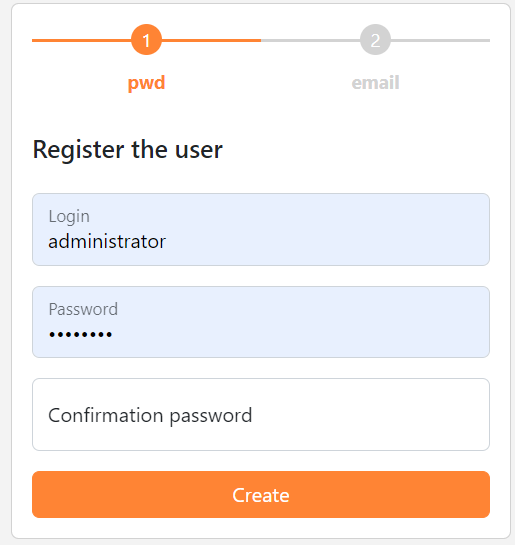

# Manual

The [Manual Identity Provisioning](../glossary) workflow in SimpleIdServer enables [Visitors](../glossary) to your web application to create a local account with the Identity Provider.

The workflow consists of one or more steps, with each step representing a different [Authentication Method](../glossary). 
For each of these methods, the visitor will enroll their credentials.

To create a Manual Identity Provisioning workflow, follow these steps :

1. Navigate to the `Identity Provisioning` menu and click on the `Manual Identity Provisioning` button.
2. Click on the `Add registration workflow` button.
3. Fill in the name; it must be unique.
4. Select one or more registration methods. The order is important as it determines the sequence of actions for registring the [Visitor](../glossary).
5. If you want this new registration workflow to be the default one when a visitor navigates to the registration page, then check the `Is Default` checkbox.
6. Click on the `Add` button to register the workflow.

You can view the registration workflow by clicking on the link displayed in the first column of the table.

The screenshot below shows a registration workflow with two steps `pwd` and `email`.

