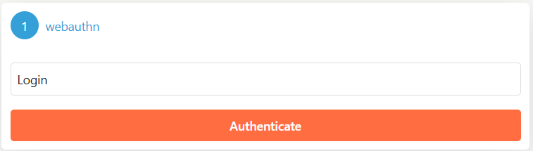

# Webauthn Authentication

WebAuthn (Web Authentication) is a modern authentication standard that enables secure, passwordless login experiences by leveraging public key cryptography. 
By using hardware security keys or built-in biometric sensors, WebAuthn significantly reduces the risks associated with traditional password-based authentication, providing an additional layer of security against phishing and other attacks.

To integrate WebAuthn authentication into your identity server, you first need to install the NuGet package `SimpleIdServer.IdServer.Fido`. This package provides the necessary components to implement WebAuthn using the FIDO2 protocol.

## Step 1 : Install the NuGet Package

Open your command line and execute the following command:

```bash  title="cmd.exe"
dotnet add package SimpleIdServer.IdServer.Fido
```

This command adds the package to your project, ensuring that you have all the dependencies needed for WebAuthn.

## Step 2 : Configure the Identity Server

After installing the package, you need to configure your identity server by modifying the `Program.cs` file. The configuration is done using a fluent API call to `AddWebauthnAuthentication`, which accepts two parameters:

* The first parameter allows you to customize the default configuration of the [Fido2NetLib](https://github.com/passwordless-lib/fido2-net-lib) library.
* The second parameter indicates whether WebAuthn should be the default authentication method for the identity server.

Below is an example of a fully configured identity server in C#:

```csharp  title="Program.cs"
webApplicationBuilder.Configuration.AddJsonFile("appsettings.json")
    .AddJsonFile($"appsettings.{webApplicationBuilder.Environment.EnvironmentName}.json", optional: true)
    .AddEnvironmentVariables();
webApplicationBuilder.AddSidIdentityServer()
    .AddDeveloperSigningCredential()
    .AddInMemoryRealms(Config.Realms)
    .AddInMemoryUsers(Config.Users)
    .AddInMemoryLanguages(Config.Languages)
    .AddWebauthnAuthentication(null, true);

var app = webApplicationBuilder.Build();
app.Services.SeedData();
app.UseSid();
app.Run();
```

## Step 3: Configure WebAuthn Options

The `SimpleIdServer.IdServer.Fido` library is further configurable via the `appsettings.json` file by adding a `WebauthnOptions` section. 
This section allows you to define properties such as the expiration time for the authentication process. For example:

| Property | Value |
| -------- | ----- |
| U2FExpirationTimeInSeconds | The duration (in seconds) for the authentication process |

Here is an example configuration:

```json title="appsettings.json"
"WebauthnOptions": {
    "U2FExpirationTimeInSeconds": "20"
}
```

The authentication window provided by the system is minimalistic, featuring a single field where the user can enter their login. 
This streamlined design helps reduce complexity and improves the user experience during the authentication process

