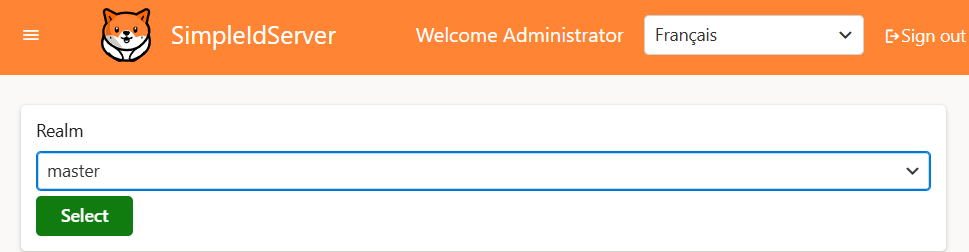

# Realm

When working with an Identity Server that supports the concept of realms, it's important to ensure that realm support is also enabled in the Admin UI. 
Without this configuration, the admin interface won't be able to properly route and manage different realms.

To activate realm support in the Admin UI, you need to modify the `Program.cs` file and enable the feature using the fluent API method `EnableRealm()`.

Here is a sample C# configuration:

```csharp  title="Program.cs"
var builder = WebApplication.CreateBuilder(args);

// Add services to the container.
builder.Services.AddRazorComponents()
    .AddInteractiveServerComponents();

builder.Services.AddIdserverAdmin("https://localhost:5001")
    .EnableRealm()
var app = builder.Build();

app.UseIdserverAdmin();
app.UseHttpsRedirection();
app.UseAntiforgery();
app.MapRazorComponents<App>()
    .AddInteractiveServerRenderMode();
app.Run();
```

Once this option is enabled, each realm will be accessible through its own dedicated URL:

```
https://localhost:5002/<realm>/clients
```

This means that if you have a realm named finance, you'll be able to manage its clients by visiting:

```
https://localhost:5002/finance/clients
```

Additionally, a list of all available realms can be retrieved from the following endpoint:

```
https://localhost:5002/availablerealms
```

Here’s an example of how it looks in the browser:

